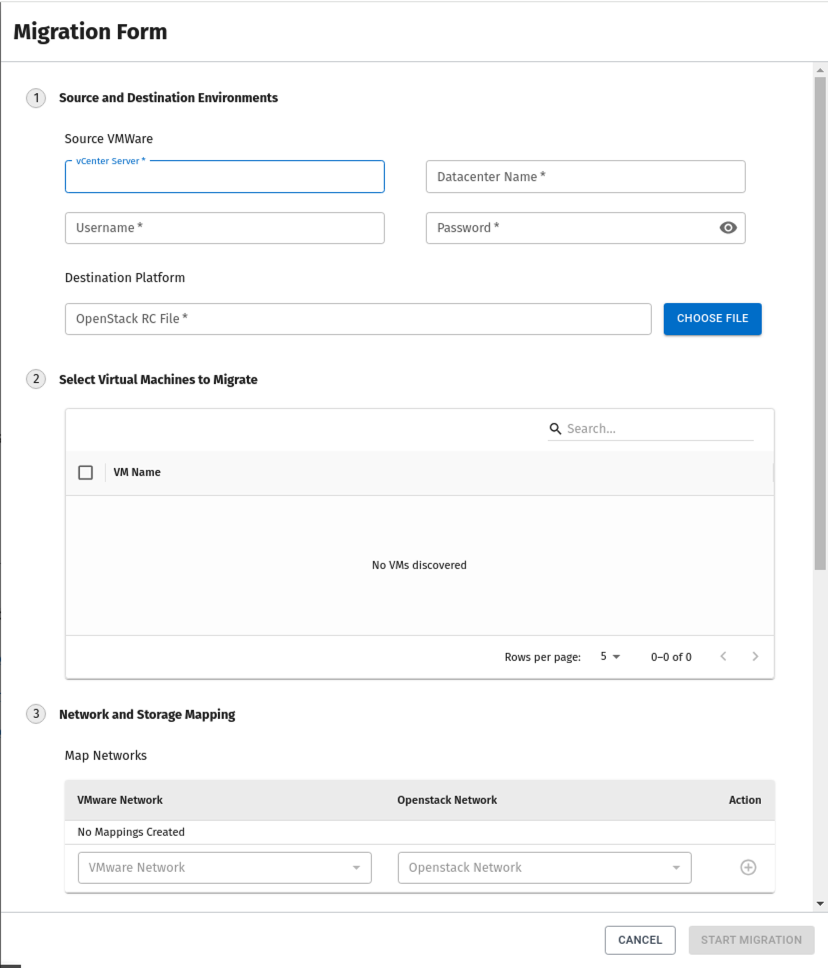
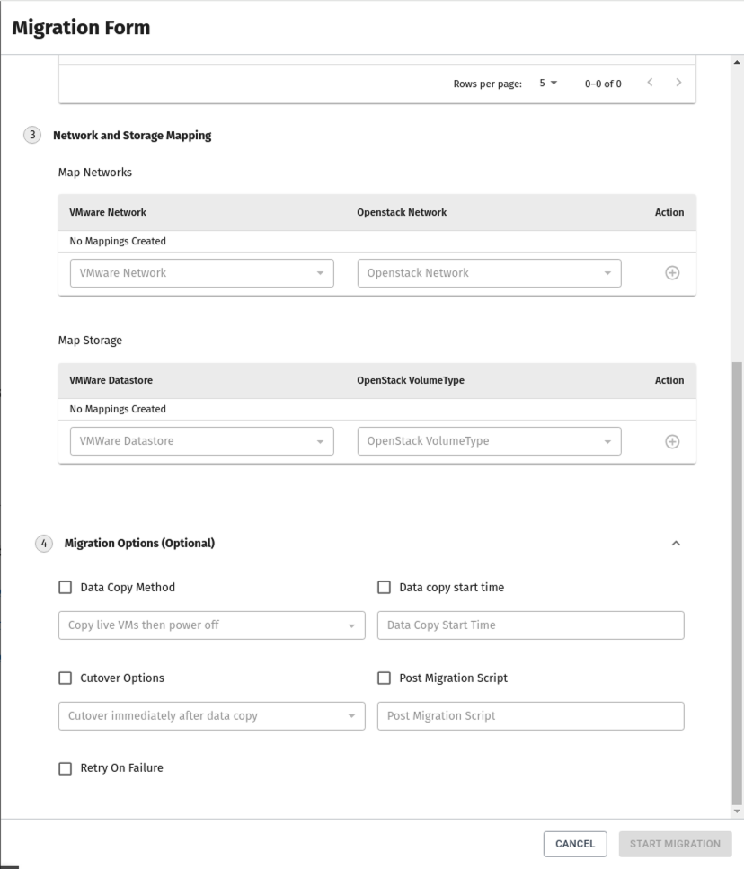
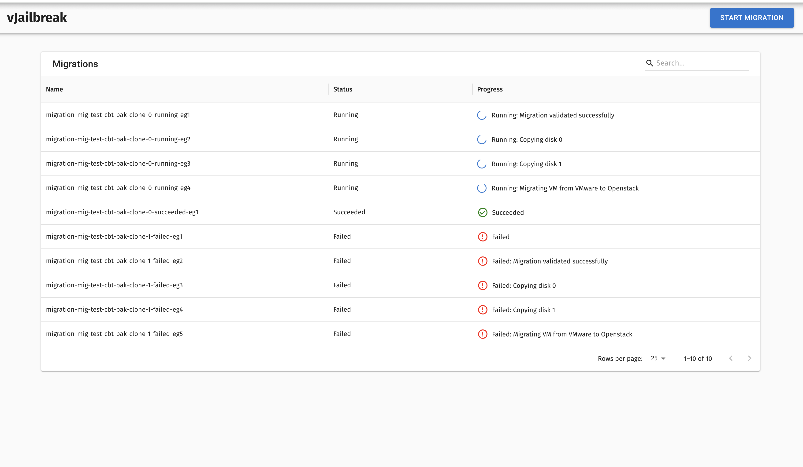
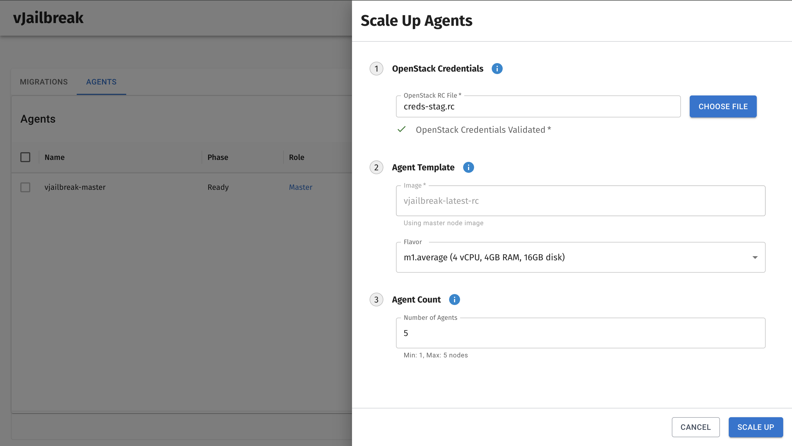
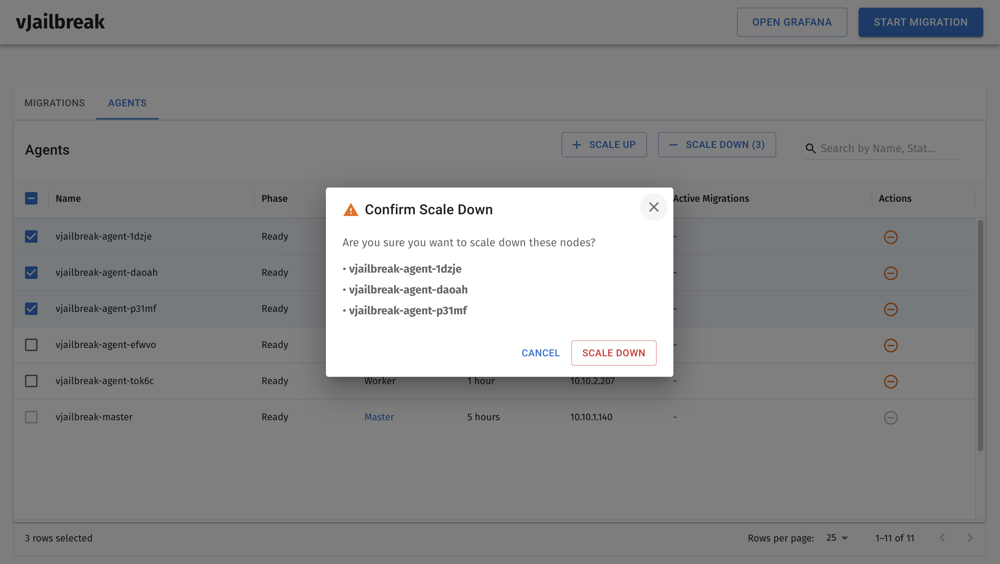

# vJailbreak
A free and open-source tool that simplifies the migration of virtual machines from VMware to any OpenStack-compliant cloud.
* Connect to a vCenter
* Select virtual machines to migrate
  * VM disks are converted from `vmdk` to `qcow2`
  * VMware Tools are uninstalled
  * Virtual devices & drivers are installed (for windows)
* Post-migration health checks are performed

----
# Documentation
All documentation for vJailbreak can be found here: [Documentation](https://platform9.github.io/vjailbreak/introduction/getting_started/)
# Demonstration
## Video Demo

## Sample Screenshots

### Form to start a migration

### Migration Progress

### Scale up Agents

### Scale down Agents

