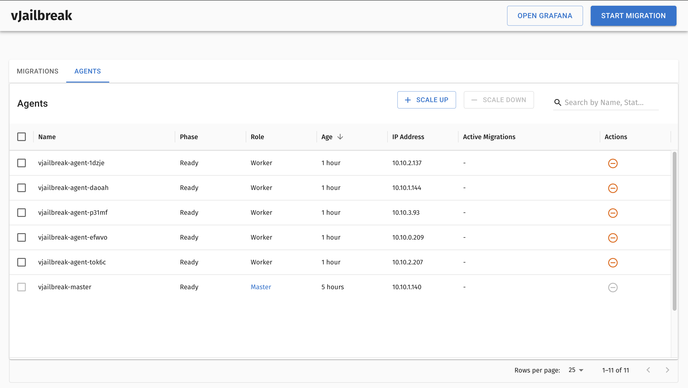

# vJailbreak
Helping VMware users migrate to OpenStack

## v2v-helper
The main application that runs the migration. It is expected to run as a pod in a VM running in the target OpenStack Environment.

## UI
This is the UI for vJailbreak.

## migration-controller
This is the k8s controller that schedules migrations. 

## v2v-cli
A CLI tool that starts the migration. It is not needed in the current version of vJailbreak.

## Video Demo

https://github.com/user-attachments/assets/1f829fba-60dc-422e-b28d-ff79347a1d87


## Sample Screenshots

### Form to start a migration


### Migration Progress


### Scale up Agents



### Scale down Agents


🚨 ** Important note ** 🚨
Do not delete the QCOW2 image used for vjailbreakvm creation—it’s needed for scaling up.

## FAQ

### Are IPs and MAC addresses persisted?
Yes, if your OpenStack network has a valid subnet range that allows the IP to be allocated, vJailbreak will create a port with the same MAC address and IP address as the source VM.

### What OS versions are supported?
We internally use virt-v2v, so all operating systems supported for conversion by virt-v2v are supported by vJailbreak. You can find a detailed list of them [here](https://libguestfs.org/virt-v2v-support.1.html#guests).

### Do I need to perform any manual steps to remove VMware Tools?
No, vJailbreak will remove them for you, with the help of virt-v2v. The process that virt-v2v uses along with alternative approaches can be found [here](https://libguestfs.org/virt-v2v.1.html#converting-a-windows-guest).

### Do I need to perform any manual steps to install drivers for Linux and Windows VMs?
No, vJailbreak will install it for you. For Windows, we allow you to specify a URL for a specific version of virtio drivers. This is useful for older Windows versions, eg. Windows Server 2012, which specifically need [v0.1.189](https://fedorapeople.org/groups/virt/virtio-win/direct-downloads/archive-virtio/virtio-win-0.1.189-1/virtio-win-0.1.189.iso) in order to work.

### What access do I need for my vCenter user to be able to perform this migration?
Please refer to the following table for the required privileges:

| Privilege | Description |
| --- | --- |
| `Virtual machine.Interaction` privileges: |     |
| `Virtual machine.Interaction.Power Off` | Allows powering off a powered-on virtual machine. This operation powers down the guest operating system. |
| `Virtual machine.Interaction.Power On` | Allows powering on a powered-off virtual machine and resuming a suspended virtual machine. |
| `Virtual machine.Guest operating system management by VIX API` | Allows managing a virtual machine by the VMware VIX API. |
| `Virtual machine.Provisioning` privileges:<br><br>Note<br><br>All `Virtual machine.Provisioning` privileges are required. |     |
| `Virtual machine.Provisioning.Allow disk access` | Allows opening a disk on a virtual machine for random read and write access. Used mostly for remote disk mounting. |
| `Virtual machine.Provisioning.Allow file access` | Allows operations on files associated with a virtual machine, including VMX, disks, logs, and NVRAM. |
| `Virtual machine.Provisioning.Allow read-only disk access` | Allows opening a disk on a virtual machine for random read access. Used mostly for remote disk mounting. |
| `Virtual machine.Provisioning.Allow virtual machine download` | Allows read operations on files associated with a virtual machine, including VMX, disks, logs, and NVRAM. |
| `Virtual machine.Provisioning.Allow virtual machine files upload` | Allows write operations on files associated with a virtual machine, including VMX, disks, logs, and NVRAM. |
| `Virtual machine.Provisioning.Clone template` | Allows cloning of a template. |
| `Virtual machine.Provisioning.Clone virtual machine` | Allows cloning of an existing virtual machine and allocation of resources. |
| `Virtual machine.Provisioning.Create template from virtual machine` | Allows creation of a new template from a virtual machine. |
| `Virtual machine.Provisioning.Customize guest` | Allows customization of a virtual machine’s guest operating system without moving the virtual machine. |
| `Virtual machine.Provisioning.Deploy template` | Allows deployment of a virtual machine from a template. |
| `Virtual machine.Provisioning.Mark as template` | Allows marking an existing powered-off virtual machine as a template. |
| `Virtual machine.Provisioning.Mark as virtual machine` | Allows marking an existing template as a virtual machine. |
| `Virtual machine.Provisioning.Modify customization specification` | Allows creation, modification, or deletion of customization specifications. |
| `Virtual machine.Provisioning.Promote disks` | Allows promote operations on a virtual machine’s disks. |
| `Virtual machine.Provisioning.Read customization specifications` | Allows reading a customization specification. |
| `Virtual machine.Snapshot management` privileges: |     |
| `Virtual machine.Snapshot management.Create snapshot` | Allows creation of a snapshot from the virtual machine’s current state. |
| `Virtual machine.Snapshot management.Remove Snapshot` | Allows removal of a snapshot from the snapshot history. |
| `Datastore` privileges: |     |
| `Datastore.Browse datastore` | Allows exploring the contents of a datastore. |
| `Datastore.Low level file operations` | Allows performing low-level file operations - read, write, delete, and rename - in a datastore. |
| `Sessions` privileges: |     |
| `Sessions.Validate session` | Allows verification of the validity of a session. |
| `Cryptographic` privileges: |     |
| `Cryptographic.Decrypt` | Allows decryption of an encrypted virtual machine. |
| `Cryptographic.Direct access` | Allows access to encrypted resources. |


## What ports do I need to open for vJailbreak to work?
Please refer the following table for the required ports:

| Port | Protocol | Source | Destination | Purpose |
| --- | --- | --- | --- | --- |
| 443 | TCP | PCD nodes | VMware vCenter API endpiont | VMware provider inventory<br><br>Disk transfer authentication |
| 443 | TCP | PCD nodes | VMware ESXi hosts | Disk transfer authentication |
| 902 | TCP | PCD nodes | VMware ESXi hosts | Disk transfer data copy |
| 5480 | TCP | PCD nodes | VMware vCenter API endpoint | VMware Site Recovery Manager Appliance Management Interface |

## Building
vJailbreak is intended to be run in a kubernetes environment (k3s) on the appliance VM. In order to build and deploy the kubernetes components, follow the instructions in `k8s/migration` to build and deploy the custom resources in the cluster.

In order to build v2v-helper,

    make v2v-helper

In order to build migration-controller,

    make vjail-controller

In order to build the UI,

    make ui

Change the image names in the makefile to push to another repository

## Usage

Download and install [ORAS](https://oras.land/docs/installation). Download the latest version of the vjailbreak image with the following command. 

    oras pull quay.io/platform9/vjailbreak:v0.1.5

This will download the vjailbreak qcow2 image locally. Upload it to your OpenStack enviroment and create your appliance VM with it.

Then, ensure that your appliance can talk to your OpenStack and VMware environments. This includes any setup required for VPNs, etc. If you do not have an OpenStack environment, you can download the community edition of [Private Cloud Director](https://platform9.com/private-cloud-director/#experience) to get started.

Copy over the [VDDK libraries](https://developer.broadcom.com/sdks/vmware-virtual-disk-development-kit-vddk/8.0) for Linux into `/home/ubuntu` of the vjailbreak VM. Untar it to a folder name `vmware-vix-disklib-distrib` in `/home/ubuntu` directory.

Deploy all the following resources in the same namespace where you installed the Migration Controller. By default, it is `migration-system`.
1. Create the Creds objects. Ensure that after you create these objects, their status reflects that the credentials have been validated. If it is not validated, the migration will not proceed.

       apiVersion: vjailbreak.k8s.pf9.io/v1alpha1
       kind: OpenstackCreds
       metadata:
         name: sapmo1
         namespace: migration-system
       spec:
         OS_AUTH_URL: 
         OS_DOMAIN_NAME: 
         OS_USERNAME: 
         OS_PASSWORD:
         OS_REGION_NAME:  
         OS_TENANT_NAME:  
         OS_INSECURE: true/false <optional>
       ---
       apiVersion: vjailbreak.k8s.pf9.io/v1alpha1
       kind: VMwareCreds
       metadata:
         name: pnapbmc1
         namespace: migration-system
       spec:
         VCENTER_HOST: vcenter.phx.pnap.platform9.horse
         VCENTER_INSECURE:  true/false
         VCENTER_PASSWORD:
         VCENTER_USERNAME: 
  
  - OpenstackCreds use the variables from the openstack.rc file. All these fields are compulsory except OS_INSECURE
  - All the fields in VMwareCreds are compulsory

2. Create the mapping between networks in VMware and networks in OpenStack

       apiVersion: vjailbreak.k8s.pf9.io/v1alpha1
       kind: NetworkMapping
       metadata:
         name: nwmap1
         namespace: migration-system
       spec:
         networks:
         - source: VM Network
           target: vlan3002
         - source: VM Network 2
           target: vlan3003
3. Create the mapping between datastores in VMware and volume types in OpenStack

		apiVersion: vjailbreak.k8s.pf9.io/v1alpha1
		kind: StorageMapping
		metadata:
		  name: stmap1
		  namespace: migration-system
		spec:
		  storages:
		  - source: vcenter-datastore-1
		    target: lvm
		  - source: vcenter-datastore-2
		    target: ceph
4. Create the MigrationTemplate

       apiVersion: vjailbreak.k8s.pf9.io/v1alpha1
       kind: MigrationTemplate
       metadata:
         name: migrationtemplate-windows
         namespace: migration-system
       spec:
         networkMapping: name_of_networkMapping
         storageMapping: name_of_storageMapping
         osType: windows/linux <optional>
         source:
           datacenter: name_of_datacenter
           vmwareRef: name_of_VMwareCreds
         destination:
           openstackRef: name_of_OpenstackCreds

  - osType is optional. If not provided, the osType is retrieved from vcenter. If it could be automatically determined, migration will not proceed.

5. Finally, create the MigrationPlan

       apiVersion: vjailbreak.k8s.pf9.io/v1alpha1
       kind: MigrationPlan
       metadata:
         name: vm-migration-app1
         namespace: migration-system
       spec:
         migrationTemplate: migrationtemplate-windows
         retry: true/false <optional>
         advancedOptions:
           granularVolumeTypes: 
           - newvoltype1
           granularNetworks:
           - newnetworkname1
           - newnetworkname2
           granularPorts:
           - <port uuid 1>
           - <port uuid 2>
         migrationStrategy:
           type: hot/cold
           dataCopyStart: 2024-08-27T17:30:25.230Z
           vmCutoverStart: 2024-08-27T17:30:25.230Z
           vmCutoverEnd: 2024-08-28T17:30:25.230Z
           adminInitiatedCutOver: true/false
           performHealthChecks: true/false
           healthCheckPort: string
         virtualmachines:
           - - winserver2k12
             - winserver2k16
           - - winserver2k19
             - winserver2k22

  - retry: Optional. Retries one failed migration in a migration plan once. Set to false after a migration has been retried.
  - advancedOptions: This is an optional field for granular control over migration options. MigrationTemplate with mappings must still be present. These options override the ones in the template, if set. If you use these options, you must only have 1 VM present in the virtualmachines list.
    - granularVolumeTypes: In case you wish to provide different volume types to disks of a VM when they are all on the same datastore, you can speccify the volume type of each disk of your VM in order. You must define one volume type for one disk present on the VM
    - granularNetworks: In case you wish to override the default network mapping for a VM, you can provide a list of OpenStack network names to use in for each NIC on the VM, in order.
    - granularPorts: In case you wish to pre-create ports for a VM with certain configs and directly provide them to the target VM, you can define a list of port IDS to be used for each network on the VM. It will override options set in granularNetworks.
  - migrationStrategy: This is an optional field
    - type: 
      - cold: Cold indicates to power off VMs in migrationplan at the start of the migration. Quicker than hot
      - hot: Powers VM off just before cutover starts. Data copy occurs with the source VM powered on. May take longer
    - dataCopyStart: Optional.  ISO 8601 timestamp indicating when to start data copy
    - vmCutoverStart: Optional. ISO 8601 timestamp indicating when to start VM cutover
    - vmCutoverEnd: Optional. ISO 8601 timestamp indicating the latest time by when VM cutover can start. If this time has been passed before the cutover can start, migration will fail.
    - adminInitiatedCutOver: Set to true if you wish to manually trigger the cutover process. Default false
    - performHealthChecks: Set to false if you want to disable Ping and HTTP GET health check. Failing these checks does not clean up the targeted VM. Default false
    - healthCheckPort: Port to run the HTTP GET health check against. Default "443"
  - virtualmachines: Specify names of VMs to migrate. In this example the batch of VMs `winserver2k12` and `winserver2k16` migrate in parallel. `winserver2k19` and `winserver2k22` will wait for the first 2 to complete successfully, and then start in parallel. You can use this notation to specify whether VMs should migrate sequentially or parallelly within a plan.

Each VM migration will spawn a migration object. The status field contains a high level view of the progress of the migration of the VM. For more details about the migration, check the logs of the pod specified in the Migration object.


## vJailbreak at Scale: Managing Agents with VjailbreakNode

vJailbreak can be scaled to perform multiple migrations in parallel by deploying additional `agents`, enabling greater efficiency and workload distribution. The VjailbreakNode Custom Resource Definition (CRD) streamlines the creation and management of these agents, ensuring seamless integration into the migration workflow. Each `VjailbreakNode` represents a VM that functions as an independent migration `agent`. These agents are dynamically added to the original `VjailbreakNode`, forming a cohesive cluster that enhances scalability, reliability, and overall migration performance.

### VjailbreakNode CRD

The `VjailbreakNode` CRD allows you to manage vJailbreak nodes within your Kubernetes cluster. Here's how to define a `VjailbreakNode` resource:

```yaml
apiVersion: vjailbreak.k8s.pf9.io/v1alpha1
kind: VjailbreakNode
metadata:
  name: example-vjailbreak-node
  namespace: migration-system
spec:
  imageid: "your-openstack-image-id" # This ID is for the first vjailbreak VMimage. It auto-populates in the UI—do not delete it. 
  noderole: "migration-worker"
  openstackcreds:
    name: "sapmo1" # Reference to your OpenstackCreds
    namespace: "migration-system"
  openstackflavorid: "your-openstack-flavor-id"
 ```
 
 ## Explanation of VjailbreakNode CRD Fields  

This `VjailbreakNode` CRD defines a Kubernetes resource that provisions a VM in OpenStack to act as a migration agent. Below is a breakdown of each field:  


### Metadata  
- **`metadata:`**  
  Metadata contains identifying details about the `VjailbreakNode`.  
  - **`name: example-vjailbreak-node`**  
    Specifies the name of this `VjailbreakNode` resource in Kubernetes.  
  - **`namespace: migration-system`**  
    Indicates the namespace where this resource is deployed within the Kubernetes cluster.  

### Spec (Specification)  
The `spec` section defines the desired state of the `VjailbreakNode`.  

- **`imageid: "your-openstack-image-id"`**  
  - This is the ID of the OpenStack image used to create the VM.  
  - **It must match the image ID used to create the initial vJailbreak VM**, ensuring compatibility across all migration agents.  

- **`noderole: "worker"`**  
  - Defines the role of the node.  
  - It should be set to `"worker"` as this node functions as a migration agent within the vJailbreak cluster.  

- **`openstackcreds:`**  
  - OpenstackCreds use the variables from the openstack.rc file.
  - **`name: "sapmo1"`** → Refers to a `Secret` or `CustomResource` storing OpenStack authentication details.  
  - **`namespace: "migration-system"`** → The namespace where OpenStack credentials are stored.  

- **`openstackflavorid: "your-openstack-flavor-id"`**  
  - Specifies the OpenStack flavor ID, which determines the VM's compute resources (CPU, RAM, disk size, etc.).  
  - The chosen flavor should align with the resource requirements for migration workloads.  

This configuration ensures vJailbreak can scale efficiently by adding worker nodes dynamically to handle multiple migrations in parallel. 🚀  

🚨 ** Important note ** 🚨
After scaling up make sure that Copy over the [VDDK libraries](https://developer.broadcom.com/sdks/vmware-virtual-disk-development-kit-vddk/8.0) for Linux into `/home/ubuntu` of the new agents. Untar it to a folder name `vmware-vix-disklib-distrib` in `/home/ubuntu` directory. 

**_NOTE:_**
To retrieve the password for logging into a worker node, follow these steps:
1. SSH into the master node and run:
   ```bash
   cat /var/lib/rancher/k3s/server/token
2. The first 12 characters of this token is your password. 

**_NOTE:_** 
In case you have to view the metrics of the agents.
1. Create a security group with the following 

### 🚀 Required Ingress Rules for Kubernetes Node with Kubelet, Metrics Server, and Prometheus

| **Component**      | **Port**  | **Protocol** | **Source** | **Purpose** |
|--------------------|----------|-------------|------------|-------------|
| **Kubelet API**    | `10250`   | TCP         | Control Plane / Prometheus | Health checks, logs, metrics |
| **Kubelet Read-Only (Optional)** | `10255` | TCP | Internal Only | Deprecated but might be used in some cases |
| **Metrics Server** | `4443`    | TCP         | Internal Cluster | K8s resource metrics (`kubectl top`) |
| **Prometheus**     | `9090`    | TCP         | Internal Cluster / Monitoring Server | Prometheus UI and API |
| **Node Exporter** (if used) | `9100` | TCP | Prometheus | Node-level metrics |
| **Cadvisor (Optional)** | `4194` | TCP | Internal Cluster / Prometheus | Container metrics collection |


