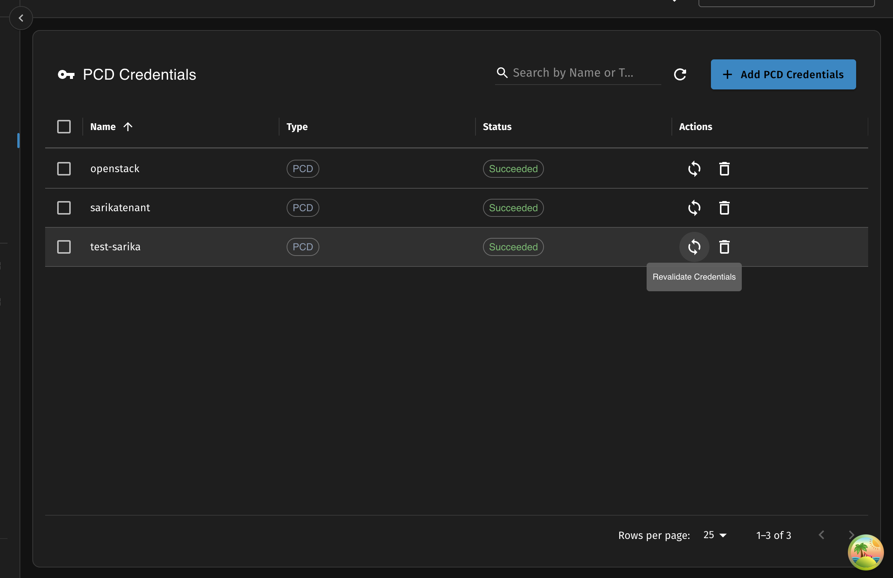
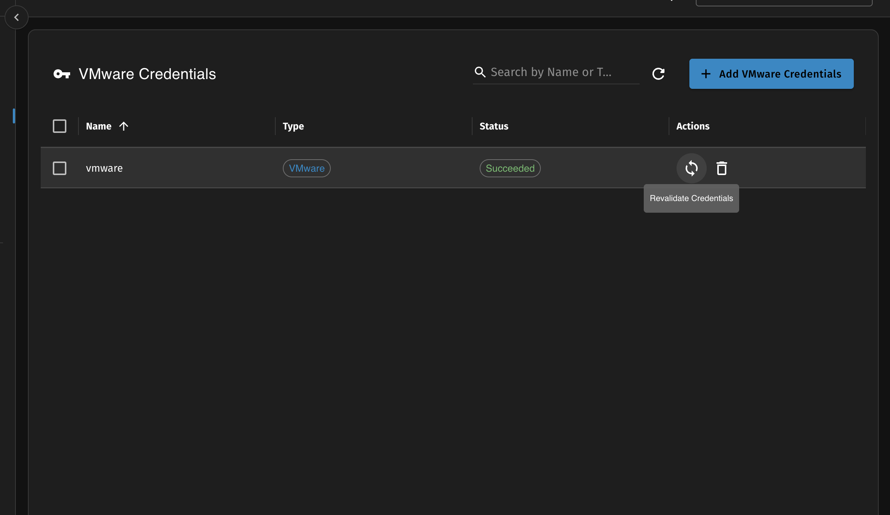

Before you start using vJailbreak, you need to provide credentials for both the VMware vCenter and OpenStack/PCD environments.

## VMware vCenter Credentials
VMware vCenter credentials are required to connect to the vCenter server and retrieve information about the virtual machines you want to migrate.

The credentials should have enough permissions to retrieve information about the virtual machines you want to migrate and if you are looking to the cluster conversion, the credentials should have enough permissions to retrieve information about the cluster, put host into maintenance mode, etc (see [Cluster Conversion](../../guides/cluster-conversion/) for more details).

The VMware credentials needs vCenter Server IP address or vCenter Server name, username and password.
The credentials also take the Datacenter name and the VMs, Hosts being worked on would be restricted to the Datacenter specified in the credentials.

Some VMware environments may be using self signed certificates, in such cases, you would need to "Allow insecure connection" option in the credentials.


## OpenStack/PCD Credentials
OpenStack/PCD credentials are required to create VMs inside the OpenStack/PCD environment. The credentials are supplied via the `openstack.rc` file that is available in the PCD environment.

To copy the content of the `openstack.rc` file, you should navigate to Settings > API Access > pcdctl RC section.

If using PCD we recommend toggling the "Is PCD credentials" option. This will automatically indicate to vJailbreak that the credentials are for PCD and would use PCD Cluster as a destination for different migrations.

For non PCD environment the `openstack.rc` file will be available as part of various distribution and documentation. The `openstack.rc` file is typically used for any automation with the OpenStack CLI.

---

### Password-Based Authentication

#### Required Variables

vJailbreak requires the following environment variables to be present in your admin RC file. **All of these variables are mandatory** and the migration will fail if any are missing:

| Variable | Description | Example |
|----------|-------------|---------|
| `OS_AUTH_URL` | OpenStack Keystone authentication URL | `https://keystone.example.com:5000/v3` |
| `OS_USERNAME` | OpenStack username with admin privileges | `admin` |
| `OS_PASSWORD` | Password for the OpenStack user | `your-secure-password` |
| `OS_REGION_NAME` | OpenStack region where VMs will be created | `RegionOne` |
| `OS_PROJECT_NAME` | OpenStack project name for VM deployment | `service` |
| `OS_PROJECT_DOMAIN_NAME` | OpenStack project domain name | `Default` |
| `OS_AUTH_TYPE` | OpenStack authentication type | `password` |
| `OS_IDENTITY_API_VERSION` | OpenStack identity API version | `3` |
| `OS_USER_DOMAIN_NAME` | OpenStack user domain name | `Default` |
| `OS_INTERFACE` | OpenStack API interface type | `public` |

#### Optional Variables

| Variable | Description | Example |
|----------|-------------|---------|
| `OS_INSECURE` | Skip SSL certificate verification | `true` or `false` |

#### User Permissions

The user specified in `OS_USERNAME` must have administrative privileges in OpenStack to:
- Create and manage virtual machines
- Access network and storage resources  
- Create and manage volumes
- Access compute, network, and storage services

The project specified in `OS_PROJECT_NAME` must exist and have sufficient quotas for the VMs being migrated.

#### Example Admin RC File (Password-Based)

```bash
export OS_USERNAME=<your-username>
export OS_PASSWORD=<your-password>
export OS_AUTH_URL=https://<fqdn of the openstack/pcd>/keystone/v3
export OS_AUTH_TYPE=password
export OS_IDENTITY_API_VERSION=3
export OS_REGION_NAME=region-1
export OS_USER_DOMAIN_NAME=Default
export OS_PROJECT_DOMAIN_NAME=Default
export OS_PROJECT_NAME=service
export OS_INTERFACE=public
export OS_INSECURE=false
````

---

### Token-Based Authentication

In addition to password-based authentication, vJailbreak also supports **token-based authentication** for OpenStack/PCD environments.

With token-based authentication, access is provided using a **Keystone authentication token** instead of a username and password. The token must be generated in your OpenStack environment and supplied to vJailbreak via the `openstack.rc` file.

This authentication method is useful in environments where password-based authentication is restricted or where short-lived credentials are preferred.

#### Required Variables

When using token-based authentication, the following environment variables **must** be present in the RC file:

| Variable                  | Description                                  | Example |
| ------------------------- | -------------------------------------------- | ------- |
| `OS_AUTH_URL`             | OpenStack Keystone authentication URL        | `https://keystone.example.com:5000/v3` |
| `OS_IDENTITY_API_VERSION` | OpenStack identity API version.              | `3` |
| `OS_REGION_NAME`          | OpenStack region where VMs will be created   | `RegionOne` |
| `OS_PROJECT_NAME`         | OpenStack project name for VM deployment     | `service` |
| `OS_PROJECT_DOMAIN_NAME`  | OpenStack project domain name                | `Default` |
| `OS_INTERFACE`            | OpenStack API interface type                 | `public` |
| `OS_AUTH_TOKEN`           | Openstack authentication token               | `<keystone-auth-token>` |
| `OS_AUTH_TYPE`            | Openstack authentication type                | `token` |

#### Optional Variables

| Variable | Description | Example |
|----------|-------------|---------|
| `OS_INSECURE` | Skip SSL certificate verification | `true` or `false` |

#### Example Admin RC File (Token-Based)

```bash
export OS_AUTH_URL=https://<fqdn of the openstack/pcd>/keystone/v3
export OS_IDENTITY_API_VERSION=3
export OS_REGION_NAME=<region-name>
export OS_PROJECT_NAME=<project-name>
export OS_PROJECT_DOMAIN_NAME=Default
export OS_INTERFACE=public
export OS_AUTH_TOKEN=<keystone-auth-token>
export OS_AUTH_TYPE=token
```

#### Notes on Token-Based Authentication

* The `OS_AUTH_TOKEN` must be generated in your OpenStack environment and must be valid at the time of migration.
* Token expiration is controlled by Keystone. If the token expires, the migration will fail and a new token must be provided.
* The `openstack.rc` must contain both the `Domain` and the `Project`/`Tenant` information. When using the OpenStack credentials, the `Domain` and `Project`/`Tenant` information is used as the destination `domain` and `project`/`tenant` for the OpenStack/PCD environment.

### Credential Revalidation

Revalidation re-runs the same flow that runs on credential creation. It is triggered automatically by the controller and can also be initiated manually from the UI.




#### What Revalidation Does

When a credential is revalidated, vJailbreak performs two steps:

1. **Authentication check** — verifies the credentials are still valid against the target environment (vCenter for VMware, Keystone for OpenStack/PCD). If authentication fails, the credential is marked invalid and migrations using it will be blocked.
2. **Resource resync** — if authentication succeeds, vJailbreak re-fetches the full inventory of resources tied to that credential.

**For VMware credentials**, revalidation refreshes:
- Virtual Machines (CPU, memory, disks, networks, datastores, power state, guest IPs)
- vCenter clusters and ESXi hosts
- Stale VMs, clusters, and hosts removed from the source are also pruned from vJailbreak

**For OpenStack/PCD credentials**, revalidation refreshes:
- Compute flavors
- Networks
- Volume types
- For PCD credentials: PCD clusters, hosts, and host configs

#### When Revalidation Runs

- **On credential creation** — initial validation + resource fetch.
- **Periodically** — the controller reconciles every 1 hour by default to keep resources in sync. Default time to requeue creds can be changed in global setting page.
- **Manually** — click the refresh button on the Credentials page to trigger an immediate revalidation.


#### Important: VMware IP Discovery and Credential Revalidation

VMware Tools and guest IP addresses can take some time to appear in vCenter after powering on a VM or making network changes.

**Best Practice:**
- Make all necessary configuration changes to your VMs in the vCenter UI first.
- **Wait** until the IP addresses are clearly visible on the VM summary page in vCenter.
- Only then click **Add Credential** or **Revalidate** in vJailbreak.

Revalidating too early may result in missing IP information, which can prevent proper IP preservation on the destination and cause migration issues.

> **Note**: vJailbreak will show a warning for VMs where network interfaces are detected but IPs could not be discovered.