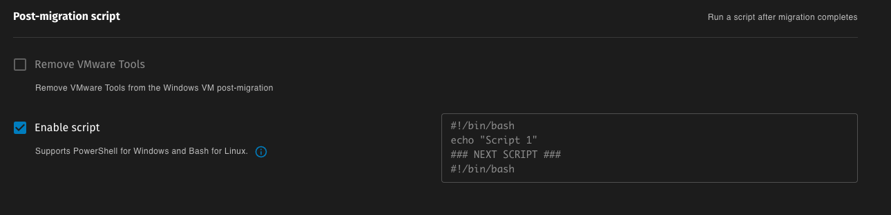
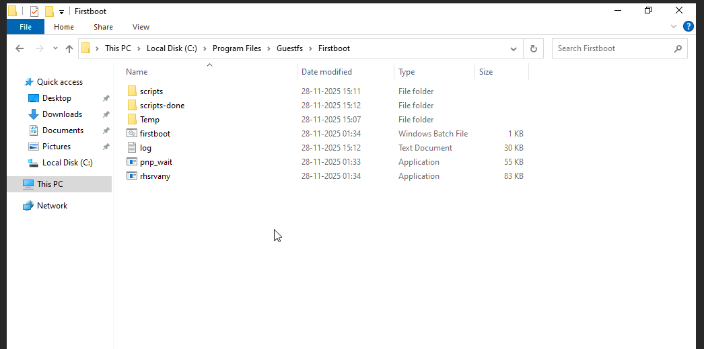
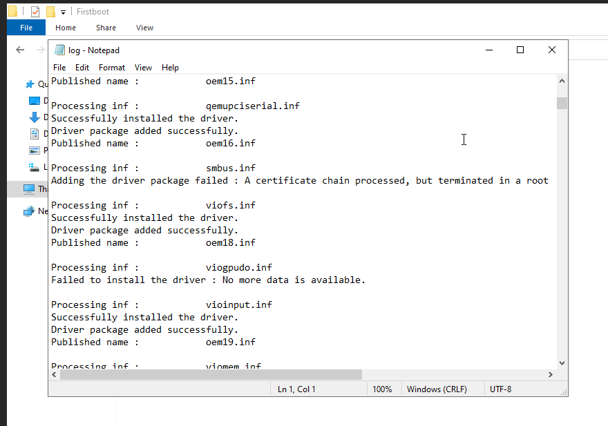
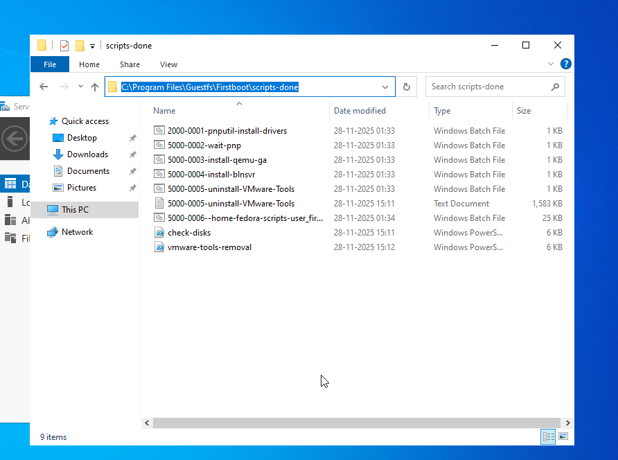
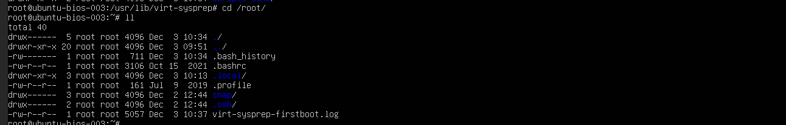
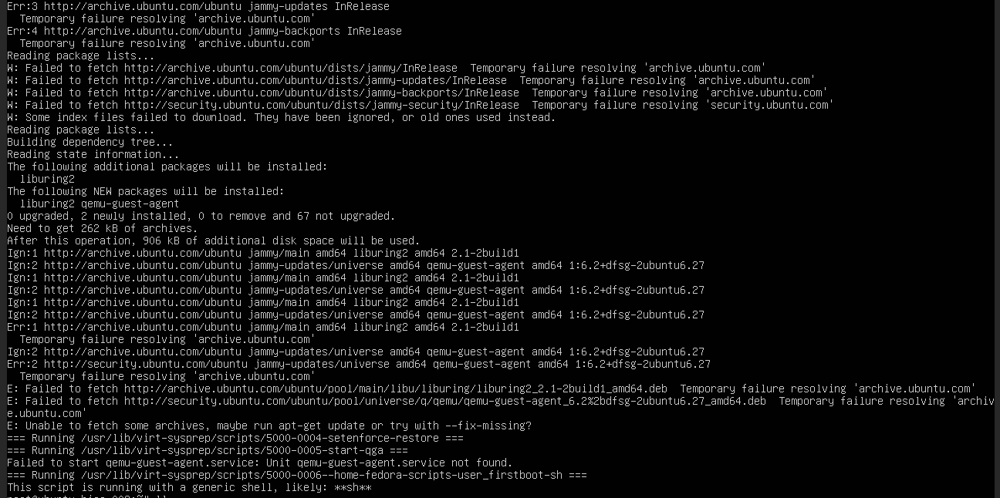
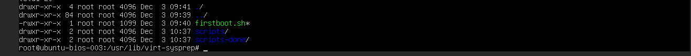

## Overview
The Firstboot Script feature allows users to run custom scripts automatically on virtual machines (VMs) immediately after they are migrated to Platform9 Cloud Director (PCD) or OpenStack environments. This capability is essential for automating post-migration configurations, installations, and other setup tasks that need to be performed on the VM upon its first boot.

Following are some use cases for Firstboot Scripts:
1. Users can automate tasks such as installing necessary software, driver removal, or system updates right after migration.
2. Configuring network settings or any other custom setup required for their specific use cases.

**Allowed Script Formats:**
1. **WindowsGuests**: `Batch` (.bat)
2. **LinuxGuests**: `sh`, `bash` (.sh)

## Firstboot Script Deployment
### How to Add the Script in Migration Form

The script is deployed through the migration form interface:
1. Navigate to the **Migration Options** section in your migration form
2. Check the **Post Migration Script** option
3. Paste the complete contents of firstboot scripts into the script field, if you have multiple scripts, append it in the end of the existing script
4. Start the migration once all the options are set

> **Note:** The script contents should be added directly into the migration form

## Execution Flow of Firstboot Script
### When and Where Does It Run?
The script executes **automatically after the migration completes and VM boots for the first time in PCD/OpenStack.**

The firstboot script feature uses [virt-v2v](https://libguestfs.org/virt-v2v.1.html) to inject the script, which internally uses [Guestfs](https://libguestfs.org/) libraries. During the migration, the process runs inside the **v2v-helper pod**.

### Order of Execution

- User provides a post-migration script via the migration form
- Script is added in the **Post-Migration Script** field
- Virt-v2v injects the scripts by applying changes to the VM disk image
- When VM boots for the first time in PCD/OpenStack, the script executes automatically

## Troubleshooting

### Accessing FirstBoot Logs

> #### For Windows Guests:

After migration, check execution logs at: `C:\Program Files\Guestfs\Firstboot\log.txt`

| Issue | Location to Check |
|-------|-------------------|
| Script Not Executing | `C:\Program Files\Guestfs\Firstboot\log.txt` for errors |
| ConfigMap Not Mounted | Check v2v-helper pod volume mounts (`mountPath: /home/fedora/scripts`, `name: firstboot`) |

***The script's success or failure can be determined by checking its location after migration:***
1. If the script executed successfully, it will be moved to: `C:\Program Files\Guestfs\Firstboot\scripts-done\`
2. If the script failed during execution, it will remain in: `C:\Program Files\Guestfs\Firstboot\scripts\`

> #### For Linux Guests:

After migration, check execution logs at: `/root/virt-sysprep-firstboot.log` with elevated privileges.

| Issue | Location to Check |
|-------|-------------------|
| Script Not Executing | `/root/virt-sysprep-firstboot.log` for errors |
| ConfigMap Not Mounted | Check v2v-helper pod volume mounts (`mountPath: /home/fedora/scripts`, `name: firstboot`) |

***The script's success or failure can be determined by checking its location after migration:***
1. If the script executed successfully, they get deleted and will not appear in: `/usr/lib/virt-sysprep/scripts/` and `/usr/lib/virt-sysprep/scripts-done/`
2. If the script failed during execution, it will remain in: `/usr/lib/virt-sysprep/scripts/`

## Link to Readily Available Firstboot Scripts
1. [Windows VMware tools Removal Script](https://github.com/platform9/vjailbreak/blob/main/scripts/firstboot/windows/vmware-tools-deletion.bat) - A script to remove VMware tools/Drivers from Windows VMs