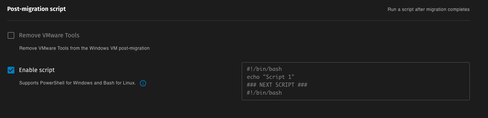
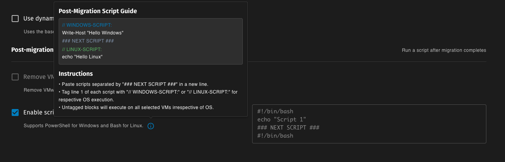

## Overview
The Firstboot Script feature allows users to run custom scripts automatically on virtual machines (VMs) immediately after they are migrated to Platform9 Cloud Director (PCD) or OpenStack environments. This capability is essential for automating post-migration configurations, installations, and other setup tasks that need to be performed on the VM upon its first boot.

Following are some use cases for Firstboot Scripts:
1. Installing or updating required software
2. Removing VMware-specific tools or drivers
3. Applying system or network configuration
4. Running environment-specific initialization tasks
5. Executing multiple setup steps sequentially after migration

The feature supports **multiple script blocks**, **OS-specific targeting**, and **independent execution** of user-provided scripts.


### Allowed Script Formats

User-provided script content depends on the guest operating system.

1. **WindowsGuests**: `Powershell` (.ps1)
2. **LinuxGuests**: `sh`, `bash` (.sh)

---

## Multiple Script Blocks

You can include **multiple script blocks** in a single migration plan.  
Separate each script block using the delimiter:

```
### NEXT SCRIPT ###
```

**Example:**

```text
// WINDOWS-SCRIPT:
Write-Host "Running Windows script part 1"

### NEXT SCRIPT ###

// WINDOWS-SCRIPT:
Write-Host "Script 2 failing intentionally"
throw "Failure"

### NEXT SCRIPT ###

// WINDOWS-SCRIPT:
Write-Host "Script 3 still runs"
```

Each block runs independently. If one script block fails, **later blocks will still execute**.


### Execution Rules

| Script Tag       | Execution Behavior                  |
|------------------|-------------------------------------|
| `WINDOWS-SCRIPT:`| Runs only on Windows VMs            |
| `LINUX-SCRIPT:`  | Runs only on Linux VMs              |
| No tag           | Runs on all VMs                     |

> **For migration plans containing both Windows and Linux VMs, OS tags are strongly recommended.**

---

## Adding a Firstboot Script in the Migration Form

To configure a post-migration firstboot script:

1. Open the **Migration Form**
2. Navigate to the **Migration Options** section
3. Enable **Enable Script** under **Post Migration Script**
4. Paste the script content into the script field
5. Separate multiple scripts using `### NEXT SCRIPT ###`
6. Use OS tags if the migration plan includes different operating systems
7. Start the migration





> **Note:**  
> Untagged script blocks run on all selected VMs.

---

## How Firstboot Scripts Work

### End-to-End Execution Flow

1. The user enables **Post Migration Script** in the migration form.
2. The script content is stored in the migration plan as `firstBootScript`.
3. The migration controller generates a **per-VM ConfigMap** containing the script.
4. The ConfigMap is mounted into the **v2v-helper pod** at `/home/fedora/scripts`.
5. During conversion, the helper reads the script and splits it into blocks using `### NEXT SCRIPT ###`.
6. Script blocks are filtered based on OS tags.
7. The system prepares OS-specific execution:

| OS      | Execution Model |
|---------|-----------------|
| Linux   | Scripts are embedded into a generated wrapper |
| Windows | Scripts are converted into PowerShell parts and executed through a scheduler |

8. When the migrated VM boots for the first time, the prepared scripts execute automatically but needs multiple reboots to complete.


## Linux Execution Model

For **Linux guests**, applicable script blocks are combined into a generated wrapper script.

The wrapper:
- Executes each user script block using Bash
- Continues execution even if one block fails
- Logs warnings when failures occur

---

## Windows Execution Model

For **Windows guests**, applicable script blocks are converted into **PowerShell script parts**.

Example generated scripts:
```
user_firstboot_part_001.ps1
user_firstboot_part_002.ps1
```

These scripts are executed using a **Windows Firstboot Scheduler**.

---

## Windows Firstboot Scheduler

The **Windows Firstboot Scheduler** orchestrates execution of built-in and user-provided scripts.  
It ensures scripts run safely and continue even if reboots occur.

### Scheduler Responsibilities
The scheduler:
- Executes scripts sequentially
- Tracks execution progress
- Survives system reboot
- Retries failed scripts
- Continues later scripts even if earlier user scripts fail

### Scheduler Files

| File                                      | Purpose                          |
|-------------------------------------------|----------------------------------|
| `C:\firstboot\0-Firstboot-Scheduler.ps1`  | Main scheduler script            |
| `C:\firstboot\Firstboot-Scheduler.log`    | Scheduler execution log          |
| `C:\firstboot\Firstboot-Scheduler_init.log`| Scheduler initialization log     |
| `C:\firstboot\Firstboot-Scheduler.state`  | Execution state tracking         |
| `C:\firstboot\scripts.json`               | Script metadata                  |

---

## Troubleshooting

### Windows Guests
Primary troubleshooting locations:

| File                                      | Purpose                              |
|-------------------------------------------|--------------------------------------|
| `C:\firstboot\Firstboot-Scheduler.log`    | Scheduler execution logs             |
| `C:\firstboot\Firstboot-Scheduler_init.log`| Scheduler initialization logs        |
| `C:\firstboot\Firstboot-Scheduler.state`  | Scheduler execution state            |
| `C:\firstboot\scripts.json`               | Script metadata                      |

You may also check the guestfs log:

```
C:\Program Files\Guestfs\Firstboot\log.txt
```

This log confirms that the injected firstboot mechanism started successfully.

### Linux Guests
Check the firstboot execution log with elevated privileges:

```
/root/virt-sysprep-firstboot.log
```

This log contains:
- Output from each script block
- Errors encountered during execution
- Warnings for failed script blocks

> **Note:**  
> Linux user script blocks are executed through a generated wrapper, so individual script files will not appear inside the guest filesystem.
