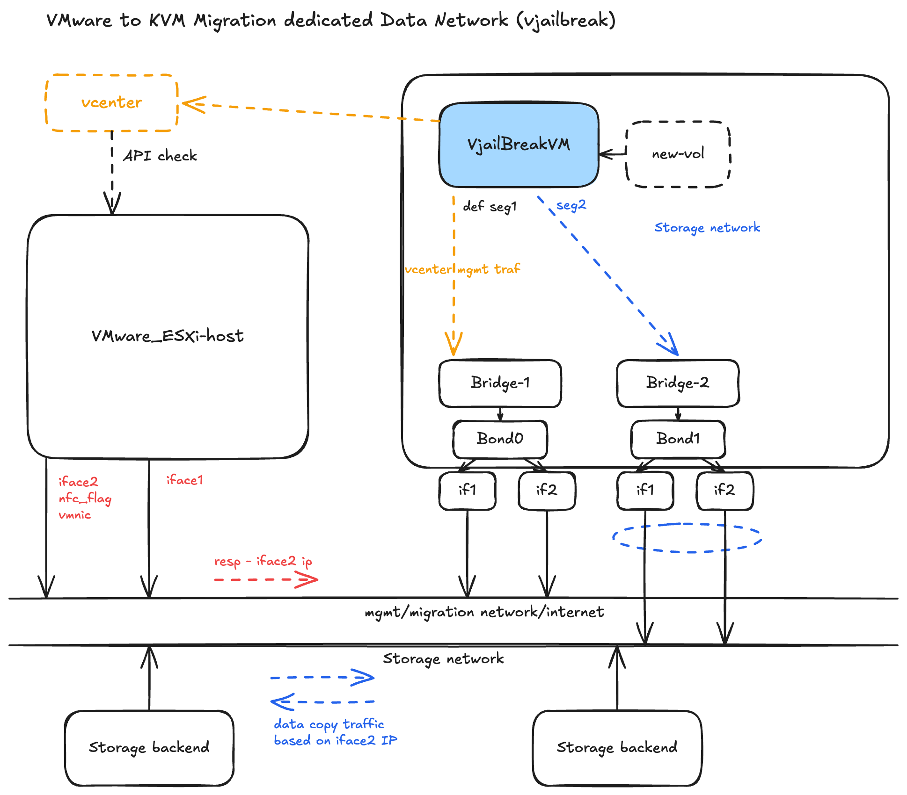

In environments where security requirements mandate separate networks for control-plane and storage traffic (e.g., a VMware underlay with a dedicated storage network that differs from the PCD host underlay), a single shared network path for both vCenter API calls and disk-copy data can cause congestion, dropped transfers, or asymmetric routing failures.

This guide explains the traffic separation design and the routing configuration required on the vJailbreak VM.

## Architecture Overview



The core design: keep vCenter's control-plane traffic and vJailbreak's disk-copy traffic on **physically distinct paths** rather than sharing one network.

### ESXi Side

The ESXi host exposes two interfaces:

| Interface | Role |
|-----------|------|
| **iface1** | Management — vCenter API calls, general connectivity |
| **iface2** | NFC data copy — tagged with `nfc_flag`, bound to VMware's NFC (Network File Copy) service. ESXi streams disk data through this interface during migrations. |

This split is enforced at the ESXi interface level. Management and data movement never contend for the same physical path.

### vJailbreak VM Side

The vJailbreak VM mirrors the same split with two bridges and bonds:

| Path | Bridge / Bond | Segment | Traffic |
|------|--------------|---------|---------|
| Management | Bridge-1 / Bond0 | seg1 (default) | vCenter API, management, internet |
| Storage | Bridge-2 / Bond1 | seg2 | Disk data copy from ESXi NFC service |

## Critical: Routing Table Configuration

This is the most operationally important detail.

When vJailbreak issues a disk-copy request, ESXi responds using **iface2's IP** — because iface2 is the interface tagged for NFC traffic. If the vJailbreak VM's outbound route for that request is not explicitly pinned to the storage interface (Bridge-2 / Bond1), the following problems occur:

- **Asymmetric routing** — request exits via the management interface, response arrives via the storage interface; the connection is dropped.
- **Silent fallback** — data copy traffic falls back onto the management network, starving it of bandwidth.
- **Transfer failures** — the NBD copy fails or times out due to IP mismatch on ESXi's NFC response path.

### Required Routing Rule

On the vJailbreak VM, add an explicit route so that any traffic destined for ESXi's NFC/data-copy service (iface2's IP subnet) is routed out through the storage interface:

```bash
# Example: route ESXi storage subnet via the storage interface
ip route add <esxi-nfc-subnet>/24 via <gateway> dev <bond1-or-bridge2-interface>
```

Replace:

- `<esxi-nfc-subnet>` — the subnet of ESXi's iface2 (NFC-tagged interface)
- `<gateway>` — the gateway on the storage network segment
- `<bond1-or-bridge2-interface>` — the interface name for Bridge-2/Bond1 on the vJailbreak VM

To make this persistent across reboots, add the route to your network configuration (e.g., `/etc/netplan/*.yaml` or `/etc/network/interfaces` depending on the OS).

### Verifying the Route

After adding the route, confirm that traffic to the ESXi NFC IP exits via the correct interface:

```bash
ip route get <esxi-iface2-ip>
```

Expected output should show the storage interface (Bond1/Bridge-2), not the management interface.

## Summary

| Concern | Solution |
|---------|----------|
| Management traffic contending with data copy | Separate physical interfaces on both ESXi and vJailbreak VM |
| ESXi NFC responses routed incorrectly | Explicit `ip route` rule on vJailbreak VM pinning NFC subnet to storage interface |
| Route lost on reboot | Persist route in OS network configuration |

Without this routing configuration, bulk disk-copy traffic will bleed onto the management network regardless of the physical interface separation, because ESXi's NFC response will always use iface2's IP and the OS will drop the asymmetric connection.
