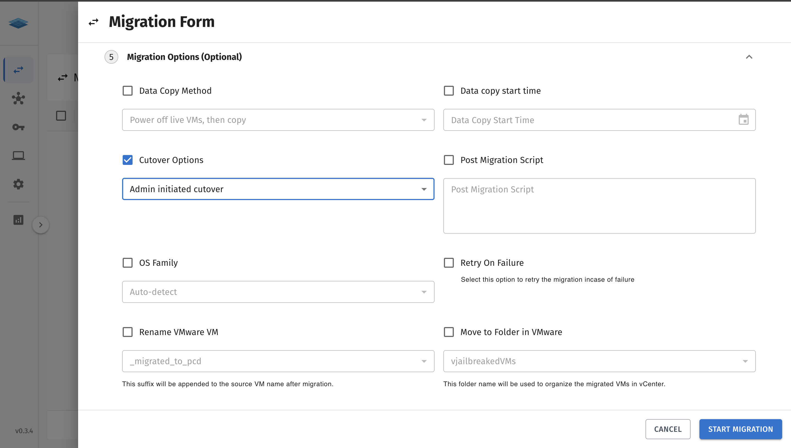
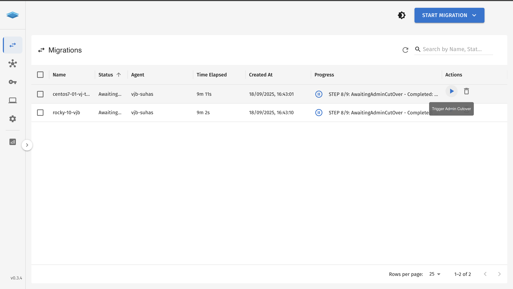
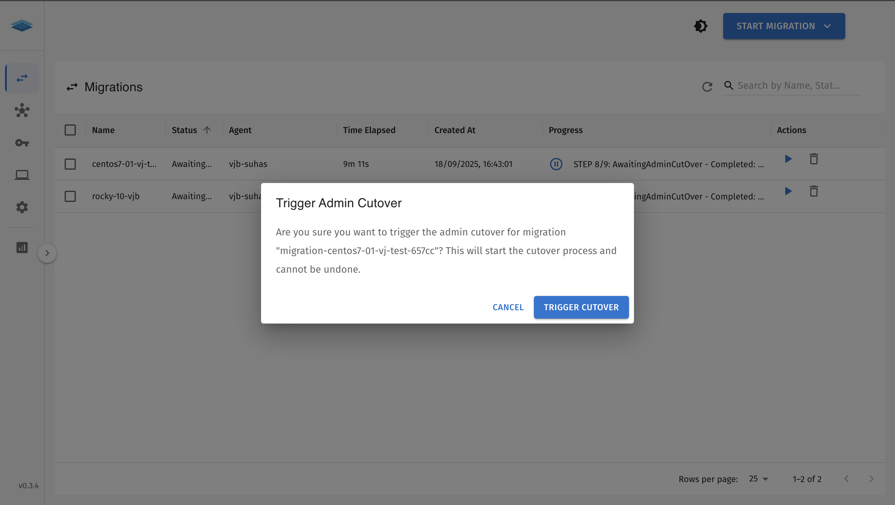
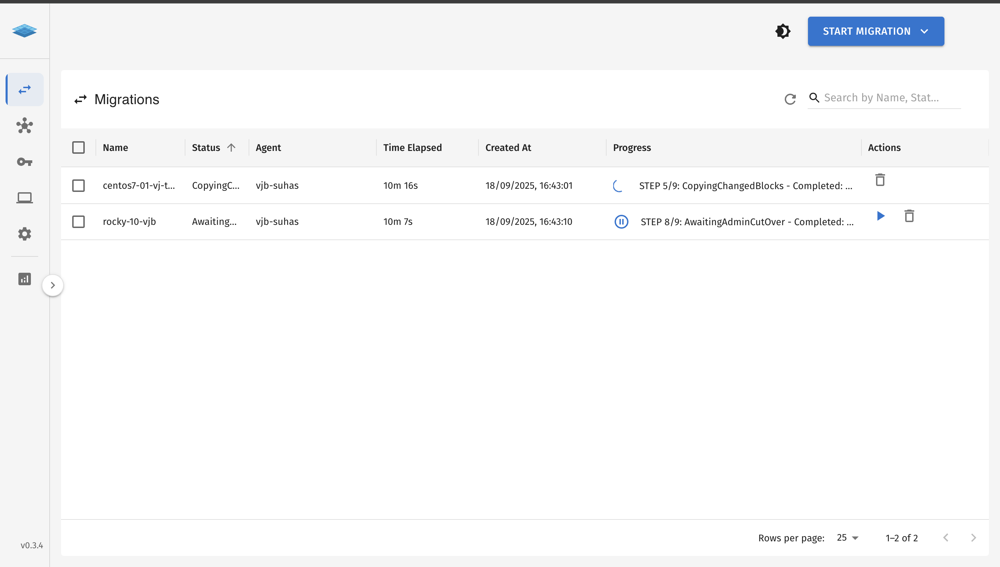

The **Admin Cutover** feature in vJailbreak is used to finalize a migration after the data transfer is complete.  
It can be triggered in two ways:
1. From the **vJailbreak UI**
2. Using **kubectl patch** on the corresponding `Pod` of the migration.


## Admin Cutover from the UI
1. Navigate to the migration you want to perform the admin cutover for, in the migration Options column, 
Select the cutover options and select Admin Initiated Cutover as shown in the Image below. 


Once the migration is done with copying data, the status of the migration will change to `waitforAdminCutover`.
You can then click on the **Admin Cutover** button to trigger the cutover process. 


2. A confirmation dialog will appear. Click on the **Confirm** button to proceed with the admin cutover.


3. After confirming, the migration will start the cutover process.



## Admin Cutover using kubectl patch
You can also trigger the admin cutover using the `kubectl patch` command.
1. First, identify the name of the migration `Pod` you want to perform the admin
cutover for. You can list all migration `Pods` using the following command:
```bash
kubectl get pods -n migration-system 
```
2. Once you have identified the migration `Pod`, you can trigger the admin cutover by
executing the following command:
```bash
kubectl patch pod pod-name -n migration-system -p '{"metadata":{"labels":{"startCutover":"yes"}}}'
```
Replace `pod-name` with the name of your migration `Pod` and `migration-system.