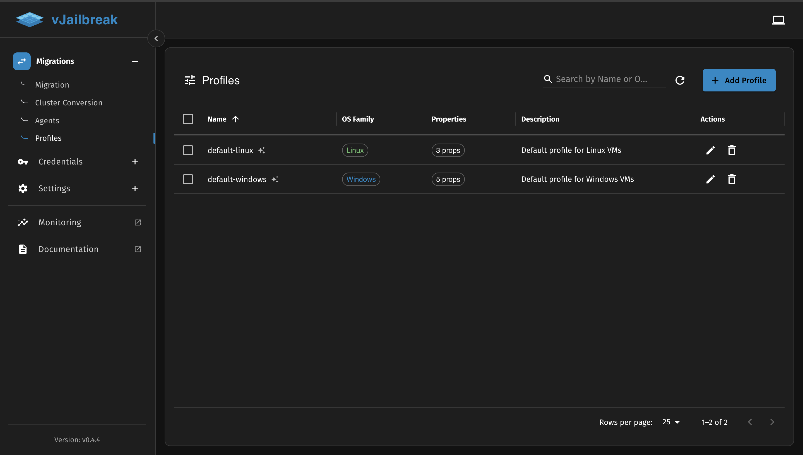
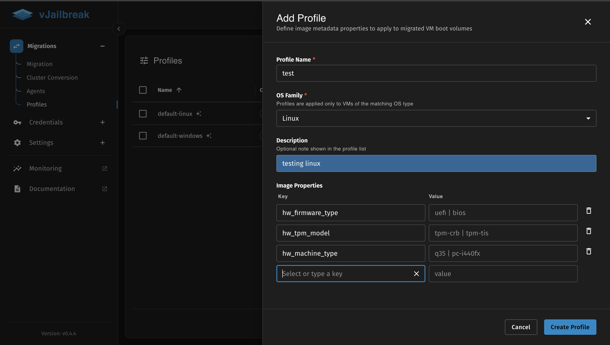
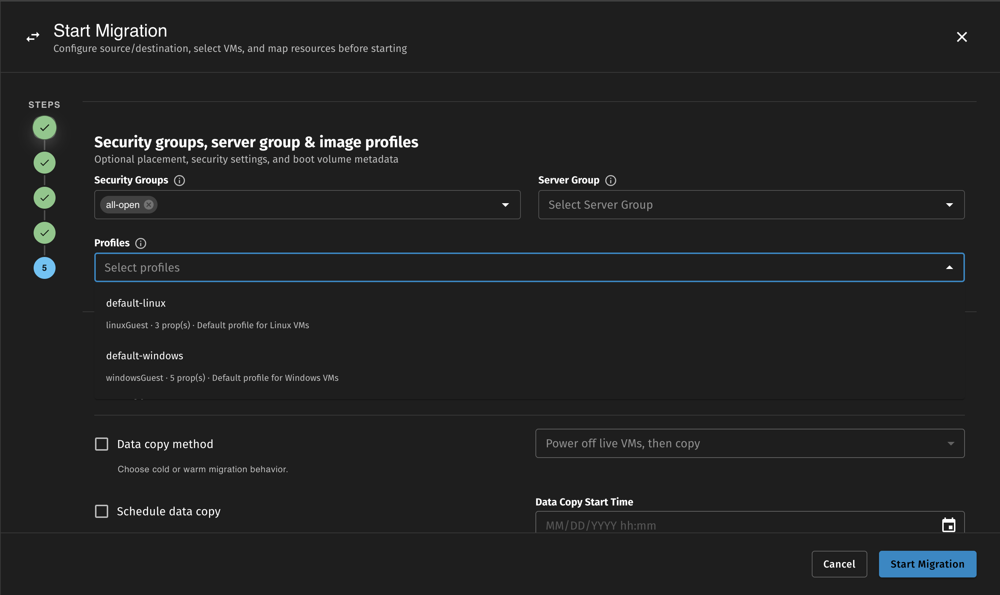

Profiles let us define a named set of OpenStack Cinder `volume_image_metadata` properties and apply them to VM boot volumes during migration. This gives us control over how the migrated VM boots and runs in OpenStack — for example, setting the firmware type, disk bus driver, video model, or guest agent settings — without having to configure each migration individually.

Navigate to the **Profiles** section in the sidebar to view and perform all CRUD operations on profiles.

## Default Profiles

vJailbreak ships with two built-in profiles that are created by default as a template:

### default-linux

Applies to Linux VMs (`linuxGuest`).

| Property | Value |
|---|---|
| `hw_qemu_guest_agent` | `yes` |
| `hw_video_model` | `virtio` |
| `hw_pointer_model` | `usbtablet` |

### default-windows

Applies to Windows VMs (`windowsGuest`).

| Property | Value |
|---|---|
| `hw_qemu_guest_agent` | `yes` |
| `hw_video_model` | `virtio` |
| `hw_pointer_model` | `usbtablet` |
| `hw_disk_bus` | `virtio` |
| `os_type` | `windows` |



:::note
Default profiles are marked with a star icon in the Profiles list. We can edit them to change their properties, but their names cannot be changed.
:::

## Creating a Profile

1. On the Profiles page, click **Add Profile**.
2. Fill in the following fields:

   - **Profile Name** — A unique name using lowercase letters, numbers, and hyphens (e.g., `windows-uefi-q35`). The name cannot be changed after creation.
   - **OS Family** — The type of VM this profile applies to:
     - `Windows` — Only applied to Windows VMs
     - `Linux` — Only applied to Linux VMs
     - `Any (applies to all VMs)` — Applied to every VM regardless of OS
   - **Description** — Optional. A short note shown in the profile list.
   - **Image Properties** — One or more key-value pairs of OpenStack volume image metadata. Type directly into the key field or select from the list of known property keys.

3. Click **Create Profile**.

### Known Image Property Keys

The property key field in the profile form offers autocomplete suggestions for common OpenStack volume image metadata keys. The hints shown alongside each key are example values.

| Key | Example Values |
|---|---|
| `hw_firmware_type` | `uefi`, `bios` |
| `hw_machine_type` | `q35`, `pc-i440fx` |
| `hw_disk_bus` | `virtio`, `scsi`, `ide` |
| `hw_scsi_model` | `virtio-scsi`, `buslogic` |
| `hw_tpm_model` | `tpm-crb`, `tpm-tis` |
| `hw_tpm_version` | `1.2`, `2.0` |
| `os_secure_boot` | `required`, `disabled`, `optional` |
| `os_require_quiesce` | `yes`, `no` |
| `os_type` | `windows`, `linux` |
| `hw_qemu_guest_agent` | `yes`, `no` |
| `hw_video_model` | `virtio`, `qxl`, `vga` |
| `hw_cdrom_bus` | `sata`, `ide`, `virtio` |
| `hw_boot_menu` | `true`, `false` |
| `hw_pointer_model` | `usbtablet`, `ps2mouse` |



:::note
We are not limited to these keys. Any valid OpenStack Cinder `volume_image_metadata` key can be used.
:::

## Selecting Profiles During Migration

In the migration form, **Step 4 (Security Groups, Server Group & Profiles)** includes a **Profiles** dropdown. We can select one or more profiles to apply during the migration.

The dropdown shows only profiles that match the OS family of the VMs we have selected:
- If our migration includes Windows VMs, profiles with OS family `Windows` or `Any` are shown.
- If our migration includes Linux VMs, profiles with OS family `Linux` or `Any` are shown.

Step 4 is optional. If we do not select any profiles, no additional image metadata is applied to the boot volumes.



## How Multiple Profiles Are Merged

When we select more than one profile, their properties are combined into a single set before being applied. The merge follows these rules:

- All unique keys from all selected profiles are included.
- If two profiles set the **same key to the same value**, there is no conflict and the value is applied once.
- If two profiles set the **same key to different values**, the UI will show a conflict error and prevent adding the second profile until the conflict is resolved.

This ensures that the final set of properties applied to the boot volume is predictable and unambiguous.

:::note
Properties are applied **in addition to** any metadata that vJailbreak sets automatically (for example, `hw_firmware_type: uefi` for UEFI VMs). If a profile specifies a key that conflicts with automatically set metadata, the profile value will override it.
:::

## Using Profiles via CLI

A `VolumeImageProfile` is a standard Kubernetes custom resource in the `migration-system` namespace. We can create and manage profiles using `kubectl`.

**View all profiles:**

```bash
kubectl get volumeimageprofiles -n migration-system
```

**View a profile's details:**

```bash
kubectl get volumeimageprofile default-windows -n migration-system -o yaml
```

**Create a custom profile:**

```yaml
apiVersion: vjailbreak.k8s.pf9.io/v1alpha1
kind: VolumeImageProfile
metadata:
  name: windows-uefi-q35
  namespace: migration-system
spec:
  osFamily: windowsGuest
  description: Windows VMs with UEFI firmware and Q35 machine type
  properties:
    hw_firmware_type: uefi
    hw_machine_type: q35
    os_secure_boot: disabled
```

```bash
kubectl apply -f windows-uefi-q35.yaml
```

To reference a profile in a `MigrationPlan`, add its name to `spec.advancedOptions.imageProfiles`:

```yaml
spec:
  advancedOptions:
    imageProfiles:
      - default-windows
      - windows-uefi-q35
```
