In this guide, we will cover how to enable the streaming of syslogs from vJailbreak VMs to fluentd and integrate with Loki running on the PCD-CE.
For this tutorial you will need working knowledge of K3s, fluentd and Loki.

### Prerequisites

- A running vJailbreak instance with SSH enabled.
- A running fluentd instance on a remote host (in this case PCD-CE Management host).
- A running grafana/loki-stack instance for this we are using PCD-CE.

### Setup vJailbreak VM for rsyslog

1. Enable K3s to write to `syslog`
2. Install rsyslog on the vJailbreak VM - If not already present
3. Configure rsyslog to forward syslogs to fluentd.
4. Configure loki to read logs from fluentd log directory.

### Enable syslog for k3s

To the service section add the following:

```shell
sudo vi /etc/systemd/system/k3s.service
```

```shell
[Service]
Type=notify
NotifyAccess=all
```

To the `ExecStart` section add the following:

```shell
ExecStart=/usr/local/bin/k3s \
    server --log=/var/log/syslog \
        '--disable' \
        'traefik' \
```

```shell
sudo systemctl daemon-reload
sudo systemctl restart k3s
```

### Configure rsyslog

1. Edit the rsyslog configuration file
2. Add the following configuration:

```shell
sudo sh -c 'echo "*.* @<fluentd-host>:5140" >> /etc/rsyslog.d/90-fluentd.conf'
```
!note: Change `<fluentd-host>` to the IP address of the fluentd host

3. Restart rsyslog

```shell
sudo systemctl restart rsyslog
```

4. Test rsyslog

```shell
sudo journalctl -f
```

### Install fluentd

1. Install fluentd on the PCD-CE Management host
2. Test fluentd

```shell
$ ulimit -n
65536
```

Please add the following lines to your `/etc/security/limits.conf` file:

```shell
root soft nofile 65536
root hard nofile 65536
* soft nofile 65536
* hard nofile 65536
```

3. Setup sysctl conf

Edit `/etc/sysctl.conf` and add the following

```shell
net.core.somaxconn = 1024
net.core.netdev_max_backlog = 5000
net.core.rmem_max = 16777216
net.core.wmem_max = 16777216
net.ipv4.tcp_wmem = 4096 12582912 16777216
net.ipv4.tcp_rmem = 4096 12582912 16777216
net.ipv4.tcp_max_syn_backlog = 8096
net.ipv4.tcp_slow_start_after_idle = 0
net.ipv4.tcp_tw_reuse = 1
net.ipv4.ip_local_port_range = 10240 65535
fs.inotify.max_user_instances = 1024
# If forward uses port 24224, reserve that port number for use as an ephemeral port.
# If another port, e.g., monitor_agent uses port 24220, add a comma-separated list of port numbers.
# net.ipv4.ip_local_reserved_ports = 24220,24224
net.ipv4.ip_local_reserved_ports = 24224
```

Then check if these are in effect

```shell
$ sysctl -p
net.core.somaxconn = 1024
net.core.netdev_max_backlog = 5000
net.core.rmem_max = 16777216
net.core.wmem_max = 16777216
net.ipv4.tcp_wmem = 4096 12582912 16777216
net.ipv4.tcp_rmem = 4096 12582912 16777216
net.ipv4.tcp_max_syn_backlog = 8096
net.ipv4.tcp_slow_start_after_idle = 0
net.ipv4.tcp_tw_reuse = 1
net.ipv4.ip_local_port_range = 10240 65535
fs.inotify.max_user_instances = 1024
net.ipv4.ip_local_reserved_ports = 24224
```

4. Install fluentd

```shell
sudo curl -fsSL https://toolbelt.treasuredata.com/sh/install-ubuntu-jammy-fluent-package5.sh | bash
```

5. Restart fluentd

```shell
sudo systemctl restart fluentd
```

6. Test fluentd

```shell
sudo systemctl status fluentd
```

### Configure fluentd

1. Edit the fluentd configuration file `/etc/fluentd/fluentd.conf`
2. Add the following configuration:

```shell
<source>
  @type syslog
  port 5140
  bind 0.0.0.0
  tag system
</source>

<match system.**>
  @type stdout
</match>
```

Ref: https://docs.fluentd.org/how-to-guides/parse-syslog

3. Restart fluentd

```shell
sudo systemctl restart fluentd
```

Generally, the logs should now show up in `/var/log/fluent/fluentd.log`.

### Verify

1. Check that rsyslog is running

```shell
sudo systemctl status rsyslog
```

2. Check that fluentd is running

```shell
sudo systemctl status fluentd
```

3. Check that syslogs from vJailbreak is being sent to the fluentd

```shell
vjb$ logger -p vjailbreak.notice "This is a test message from Rsyslog - Hello Openstack!"
```

4. Check that fluentd is receiving the logs

```shell
pcd$ tail -f /var/log/fluent/fluentd.log
```

### Setup Loki on PCD-CE

1. Login to the PCD-CE Management Host
2. Then export the kubeconfig

```shell
export KUBECONFIG=/etc/rancher/k3s/k3s.yaml
```

3. Install Loki using helm
   Use the following loki-config.yaml

```
loki:
  image:
    tag: 2.9.3
  enabled: true

grafana:
  enabled: false

promtail:
  enabled: true

  config:
    server:
      http_listen_port: 3101
      grpc_listen_port: 0
    positions:
      filename: /tmp/positions.yaml
    clients:
      - url: http://loki:3100/loki/api/v1/push
    snippets:
      extraScrapeConfigs: |-
        - job_name: fluentd
          static_configs:
            - targets:
                - localhost
              labels:
                job: fluentd
                __path__: /hostlogs/fluent/*.log
          pipeline_stages:
            - match:
                selector: '{job="fluentd"}'
                stages:
                  - regex:
                      expression: '.*'
                  - timestamp:
                      source: time
                      format: RFC3339
                  - output:
                      source: message

  extraVolumes:
    - name: host-logs
      hostPath:
        path: /var/log/fluent
        type: Directory
    - name: tmp
      emptyDir: {}

  extraVolumeMounts:
    - name: host-logs
      mountPath: /hostlogs/fluent
      readOnly: true
    - name: tmp
      mountPath: /tmp

  serviceAccount:
    create: true

rbac:
  create: true

persistence:
  enabled: true
  size: 10Gi
  storageClassName: ""
  accessModes:
    - ReadWriteOnce
```

```shell
helm upgrade --namespace pcd-community --install loki grafana/loki-stack -f loki-config.yaml
```

4. Check if all the loki pods are `running`

```shell
kubectl get pods -n pcd-community | grep loki
```

5. Add Loki as a data source in Grafana

- Add it manually in the grafana UI
  Configuration > "Add Datasource" > Loki > "url: http://loki:3100" > "Save & Test"
- Add it using a configmap

  Add the configmap

  ```shell
  kubectl apply -f loki-datasource.yaml
  ```

  Restart the deployment

  ```shell
  kubectl rollout restart deployment prometheus-stack-grafana
  ```

Go to "Explore" > "Loki" to start exploring the logs.

6. You can use the query below to browse the logs

```shell
{job="fluentd"} |= ``
```

### Flow of Logs

```mermaid
architecture-beta
    group vJailbreak(server)[vJailbreak VM]
        service k3s(logos:kubernetes)[K3s] in vJailbreak
        service syslog(disk)[Syslog] in vJailbreak
        service rsyslogd(internet)[rsyslogd] in vJailbreak

    group PCD(server)[PCD]
        service fluentd(disk)[fluentd] in PCD
        service loki(database)[Loki] in PCD
        service grafana(logos:grafana)[Grafana] in PCD
    
    k3s:L -- R:syslog
    syslog:B -- T:rsyslogd
    rsyslogd:R -- R:fluentd
    fluentd:B -- T:loki
    loki:L -- R:grafana

```


### Version of tools used

1. Fluentd

```shell
fluentd --version
fluent-package 5.2.0 fluentd 1.18.0 (46372ddd521870f6a203baefb5a598209486d0bc)
```

2. Loki & grafana

```shell
NAME         CHART                           APP VERSION
grafana      grafana-8.11.1                  11.6.0
loki         loki-stack-2.10.2               v2.9.3
```
