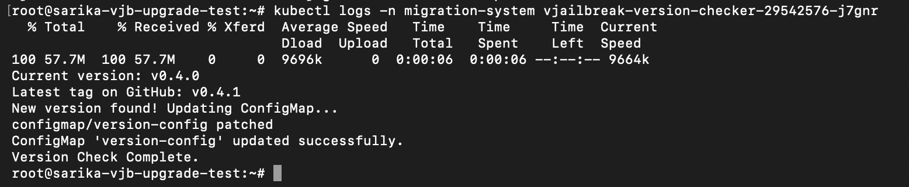
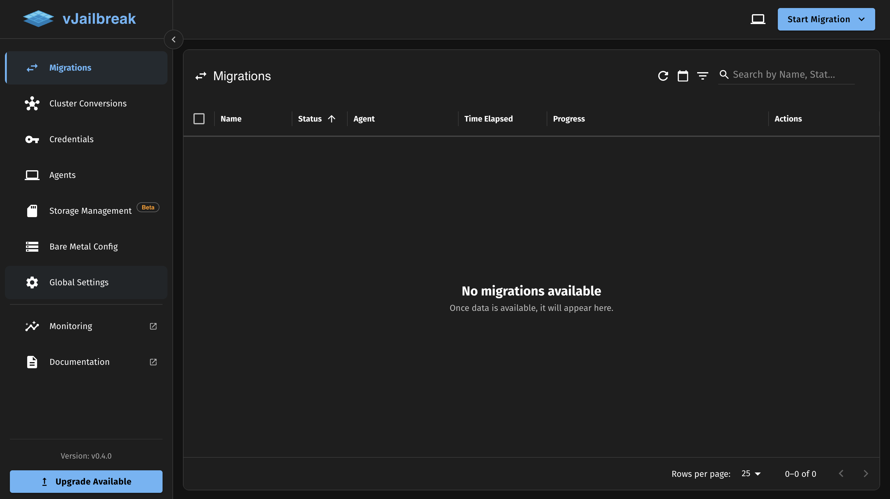
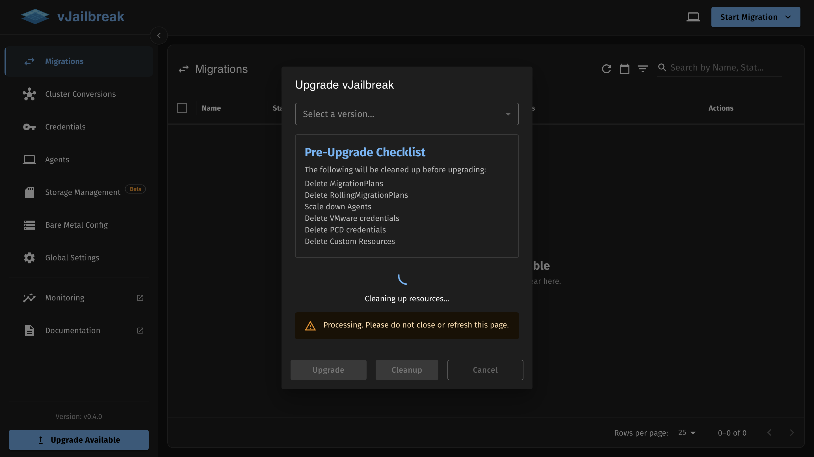
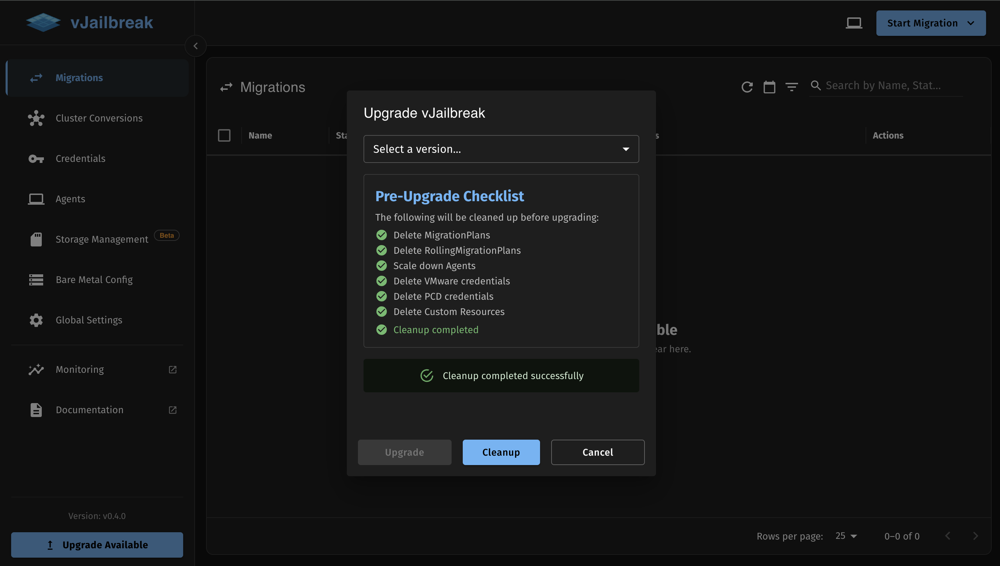
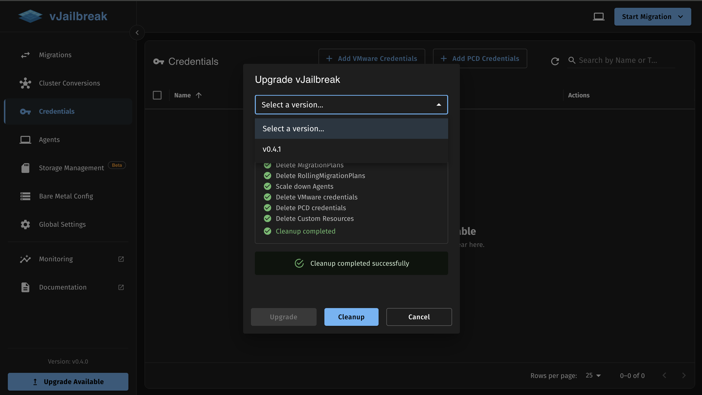
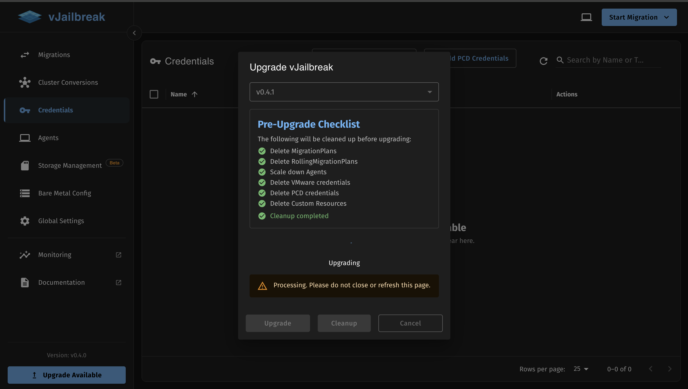
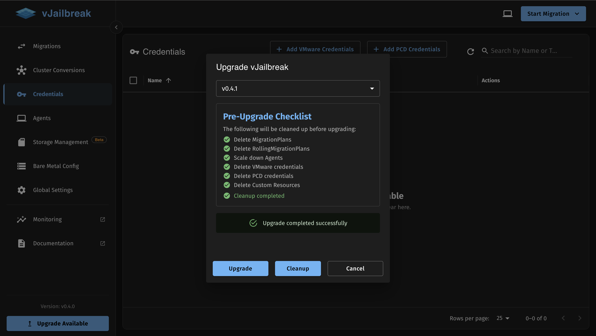

vJailbreak supports an in-place upgrade feature to go from one version to other higher version. This feature is supported starting from v0.4.0 as the base to subsequent versions. 

During the upgrade, only container images, ConfigMaps, and Custom Resource Definitions (CRDs) are modified. We currently do not support the upgrade of the base vJailbreak image or existing Custom Resources (CRs). Therefore, a pre-upgrade cleanup of these resources is required.

## Upgrade Process

### 1. Trigger Upgrade Check CronJob (Optional)

This step is completely optional and can be done manually if you do not want to wait for the next scheduled check. Run the `vjailbreak-version-checker` CronJob to detect if a newer version (e.g., v0.4.1) is available.

You may:
- Wait for the scheduled time

OR

- Temporarily modify the schedule to trigger it. Example (run after 5 minutes):
  ```yaml
  # Change the schedule line in the cronjob to:
  schedule: "*/5 * * * *"
  ```

After the CronJob runs, a new pod will be created. Check the pod logs to verify whether an upgrade is available:
```bash
kubectl get pods -n migration-system
kubectl logs <cronjob-pod-name> -n migration-system
```

If v0.4.1 is available, the logs will indicate the upgrade availability.



### 2. Check for Updates
Look for the **Upgrade Available** button at the bottom left of the vJailbreak navigation sidebar. Clicking this button will open the Upgrade vJailbreak modal.



### 3. Pre-Upgrade Cleanup
Before upgrading, vJailbreak requires a cleanup of existing resources to ensure a smooth transition. The pre-upgrade checklist includes:
- Delete MigrationPlans
- Delete RollingMigrationPlans
- Scale down Agents
- Delete VMware credentials
- Delete PCD credentials
- Delete Custom Resources

Click the **Cleanup** button to initiate this process. Wait for all items to show a green checkmark and the "Cleanup completed successfully" message to appear.




### 4. Select Version
Once the cleanup is successful, click the **Select a version...** dropdown and choose the target version you wish to upgrade to (e.g., `v0.4.1`).



### 5. Initiate Upgrade
With the version selected, the **Upgrade** button will become enabled. Click it to start the upgrade process.



### 6. Wait for Completion
You will see an "Upgrading" spinner and a warning: **Processing. Please do not close or refresh this page.** Wait for the process to complete.



Once the upgrade is marked as successfully completed, the UI will hold on the screen for 3 seconds before automatically refreshing.

:::tip[Recommendation]
For safety, it is highly advised to perform a **hard refresh** of your browser before using the UI immediately after an upgrade.
:::

:::caution[Important]
Do not close or refresh your browser window while the upgrade is in progress, as this may interrupt the operation.
:::