## Overview

While Virtualization Based Security (VBS) and Virtual Trusted Platform Module (vTPM) provide important security protections for the VM, V2V helpers and guestfs require proper read and write access to the VM's disks. Temporarily disabling these features ensures that migration and disk operations can proceed reliably.

:::caution
Windows 11 with vTPM requires an account for login to the VM. Users may need to reset their PIN after disabling vTPM. Ensure you have a **backup email configured** to reset the PIN or recover the password post migration.
:::

## Prerequisites

- **VMware Native Key Provider** (default vCenter-level key provider) must be configured for enabling vTPM on the source VM.
- On PCD, use `tpm_version: 2.0` and `tpm_provider: tpm-crb` as extra metadata specs on the VM flavor to enable vTPM post migration.

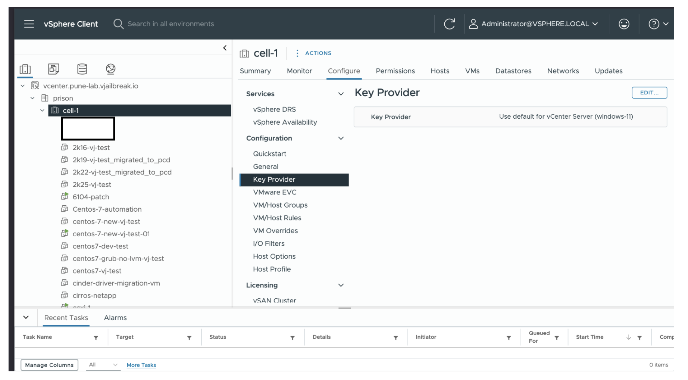

## Enabling VBS and vTPM During Windows 11 Installation

When installing Windows 11, the user can enable VBS and vTPM at the OS selection stage by checking **"Enable Windows Virtualization Based Security"**.

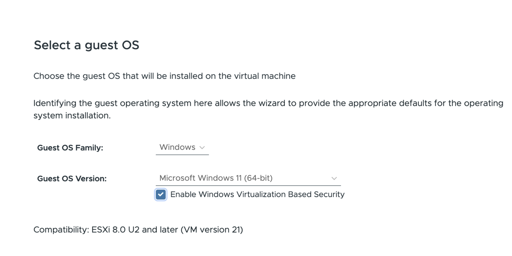

On the next stage (Customize hardware), you can verify that the **Trusted Platform Module** is present under **Security Devices**.

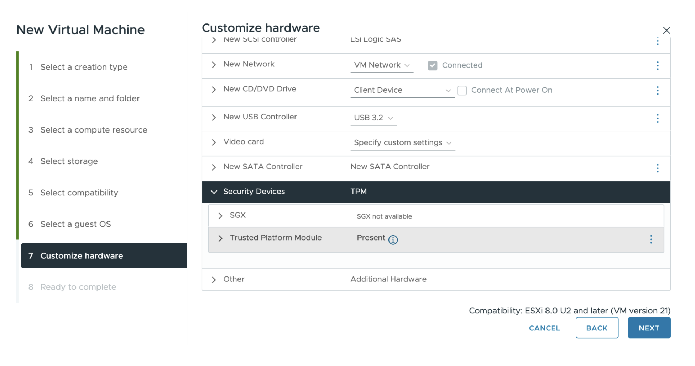

## Pre-Migration Steps

### Step 1: Power Off the Guest OS

Power off the guest OS on vCenter so that you can edit the VM settings and disable VBS and vTPM.

### Step 2: Disable Virtualization Based Security

1. Right-click the VM in vCenter and select **Edit Settings**.
2. Navigate to the **VM Options** tab.
3. Expand **Virtualization Based Security** and **uncheck** the **Enable** checkbox.
4. Click **OK** to save.

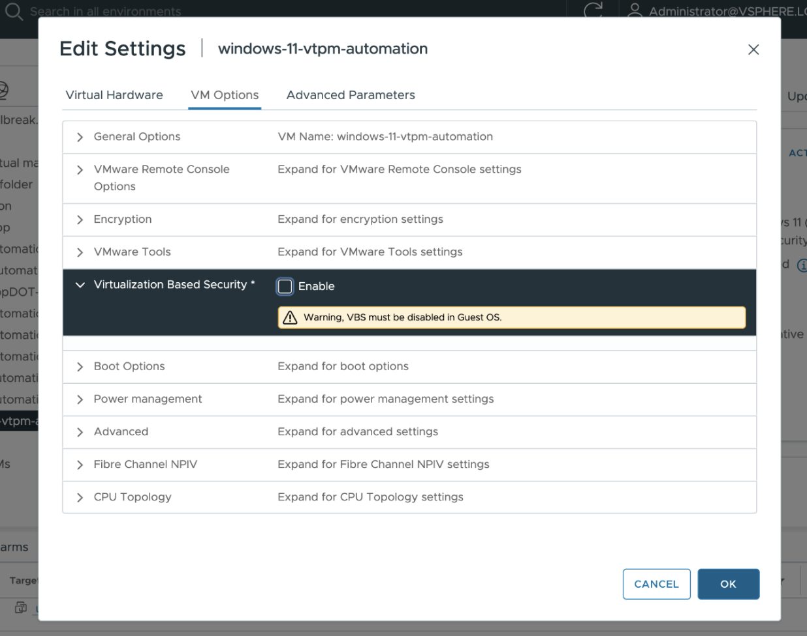

### Step 3: Change VM Encryption Policies

Change the encryption policies of the VM to the **Datastore Default** policy:

1. Right-click the VM in vCenter.
2. Go to **VM Policies → Edit VM Storage Policies**.
3. Set the VM storage policy to **Datastore Default**.
4. Click **OK** to apply.

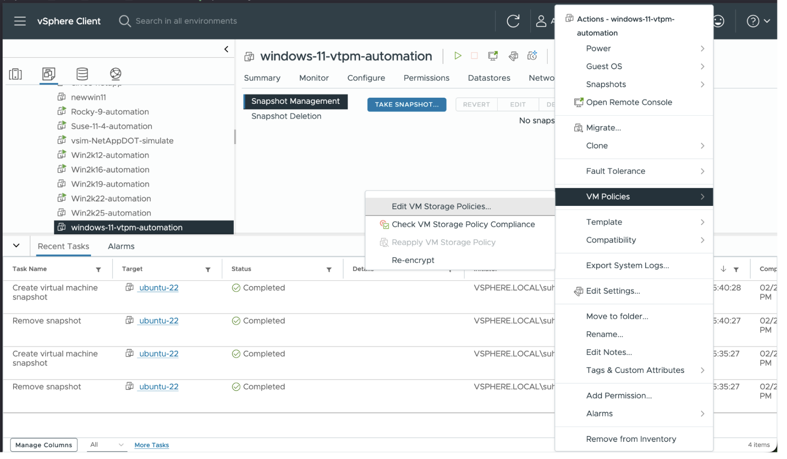
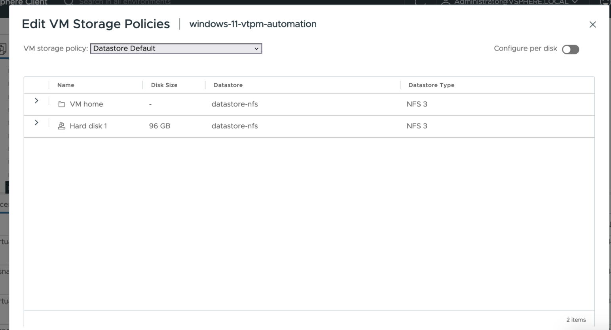

### Step 4: Remove vTPM Device

1. Right-click the VM in vCenter and select **Edit Settings**.
2. Under **Security Devices**, locate the **Virtual TPM** device.
3. Remove the vTPM device and confirm the deletion when prompted.

:::caution
Removing TPM will render all encrypted data on this VM unrecoverable. Ensure you have proper backups before proceeding.
:::

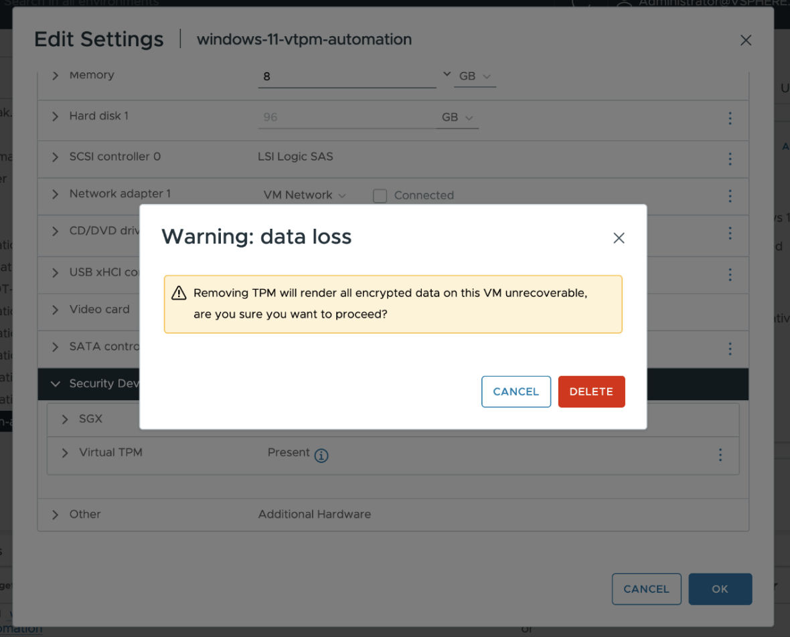

## Start Migration

With VBS disabled, encryption policies reset, and the vTPM device removed, proceed with the migration using vJailbreak as usual.

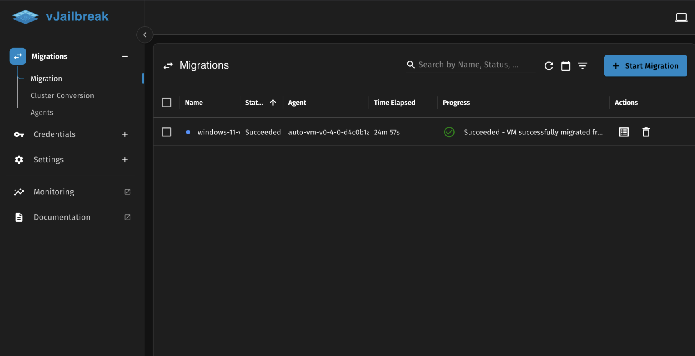

## Post-Migration Steps

After the migration completes successfully, re-enable vTPM on the VM in PCD by following the steps below.

### Step 1: Reset PIN Using Backup Email

Since vTPM was removed before migration, the user will need to reset their PIN using the backup email configured earlier.

### Step 2: Create a New Flavor with TPM Metadata

Create a new flavor (or update an existing one) with the same size as the migrated VM, adding the following TPM metadata:

| Key             | Value    |
|-----------------|----------|
| `hw:tpm_model`  | `tpm-crb`|
| `hw:tpm_version`| `2.0`    |

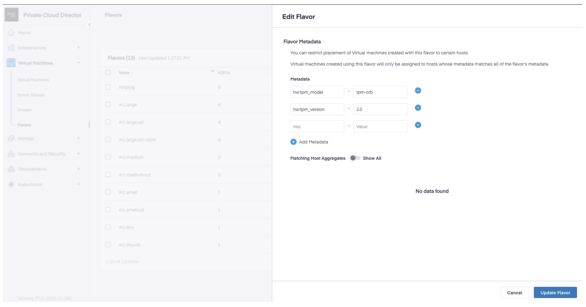

### Step 3: Resize Migrated VM Using the TPM Flavor

1. Navigate to the migrated VM in PCD.
2. Resize the VM using the newly created flavor with TPM metadata.
3. Confirm the resize operation.

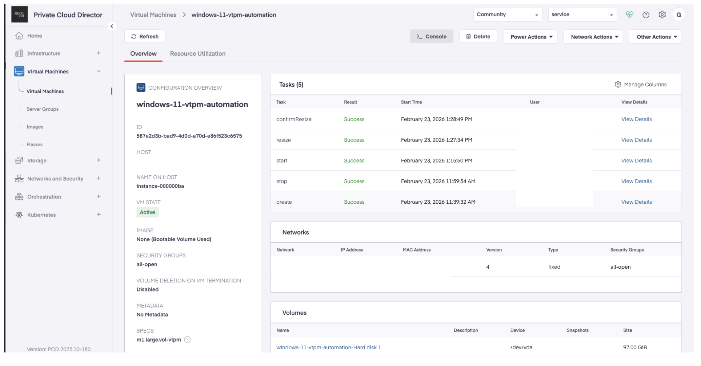

### Step 4: Verify TPM is Enabled

After the resize completes, verify that TPM is enabled on the VM:

- **From the hypervisor**: Run `virsh dumpxml <instance> | grep -i tpm` to confirm the `<tpm model='tpm-crb'>` block is present in the VM's XML definition.

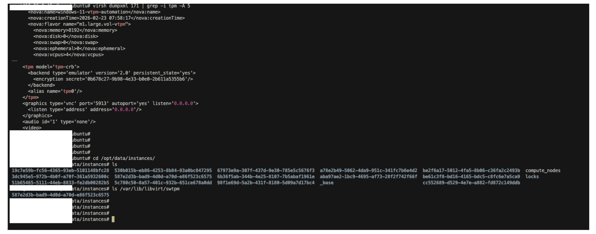

- **From inside the VM**: Open **TPM Management** (`tpm.msc`) and verify that the TPM status shows **"The TPM is ready for use."**

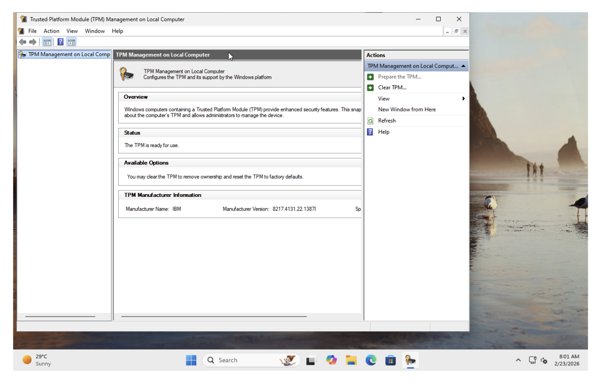
