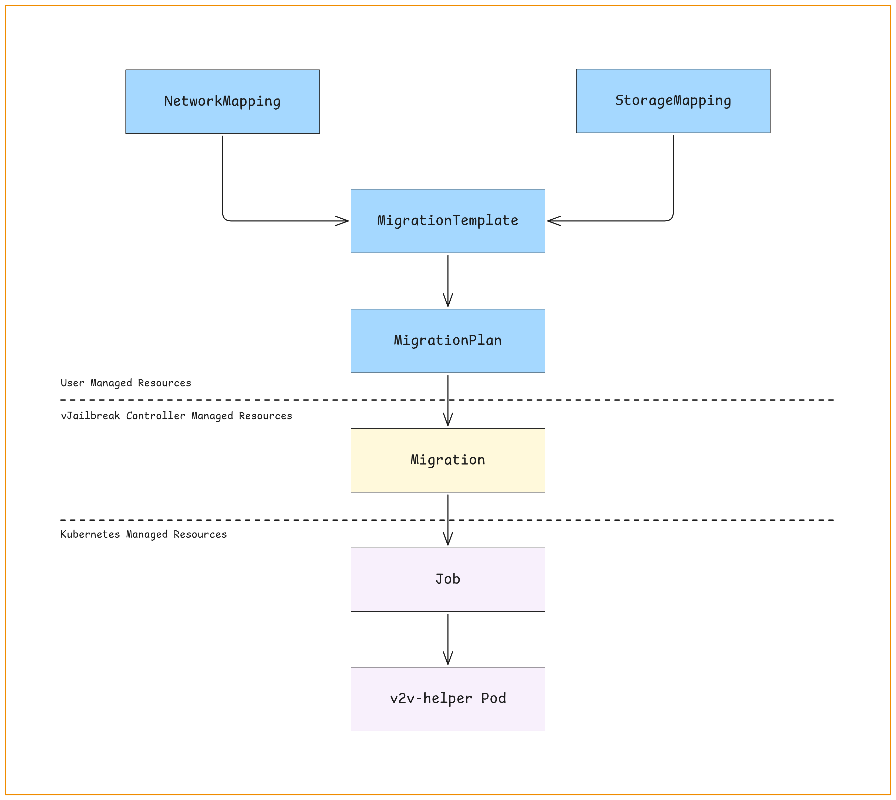

vJailbreak comprises multiple Kubernetes Controllers which work on Custom Resources (CRs). When we perform the migrations through the UI, the UI itself takes care of creating these CRs for us, hence paving the way for migration to happen. In this tutorial, we will understand how we can migrate a VM using vJailbreak via CLI. These steps might be helpful if you are looking to automate the migration.


## Flow of information and resource creation

Before moving to the action, let’s understand the various resources that will be created to perform a migration, and how they are related to each other.


**Note**: In the diagram above, the specification/configuration flows towards the arrow, and the status travels backwards (from `v2v-helper` Pod up till `MigrationPlan`).


### Glossary

Let’s get familiar with the resources mentioned in the diagram above. These resources are used by vJailbreak to perform the migration.


* **NetworkMapping**: Defines how source VMware networks map to destination OpenStack networks. Required for configuring network interfaces for VM's during migration.
* **StorageMapping**: Maps source VMware datastores to OpenStack storage backends.
* **MigrationTemplate**: It defines a reusable set of configurations for migrating virtual machines (VM's) from VMware to OpenStack.
* **MigrationPlan**: MigrationPlan contains the VM's to be migrated, provides reference to migration template which needs to be followed, and also specifies the way VM's have to be migrated. A migration plan can be used for migrating multiple VM's in batches.
* **Migration**: For each VM, there is an individual migration custom resource, which provides reference to the migration plan to be followed and the pod which is going to execute the migration. Migration custom resource is maintained by the vJailbreak controller itself.
* **Job**: With migration custom resource in place, the vJailbreak controller creates a Kubernetes Job, which will in turn create the v2v-helper pod to execute migration for the particular VM mentioned in the Migration custom resource.
* **v2v-helper pods**: Based on the definition of the job created by vJailbreak controller, kubernetes creates a pod to perform the actual VM migration. These pods are temporary workloads that run the helper logic and handle all the migration steps such as image conversion, transfer, and creation of OpenStack resources.

**Note**: `NetworkMapping`, `StorageMapping`, `MigrationTemplate`, `MigrationPlan`, and `Migration` are Custom Resources.

Now that we have a basic understanding of the resources that will be useful during our journey, let’s start on the migration part.


## How to migrate a VM using CLI or kubectl?


### What are we going to do?

First, we will gather some configuration details. We will use those pieces of configuration details together to create some custom resources, which will be then picked by the Migration Controller, and the migration will take place accordingly. While migration takes place, we will check various resources to monitor the progress of the migration.

* [Gather Information](#gather-information)
    * [Gather the credentials to VMware vCenter and OpenStack](#gather-the-credentials-to-vmware-vcenter-and-openstack)
    * [Gather the details of the VM to be migrated](#gather-the-details-of-the-vm-to-be-migrated)
    * [Gather the details of OpenStack networks and volumeTypes](#gather-the-details-of-openstack-networks-and-volumetypes)
* [Creation of Kubernetes resources](#creation-of-kubernetes-resources)
    * [Create the StorageMapping custom resource](#create-the-storagemapping-custom-resource)
    * [Create the NetworkMapping custom resource](#create-the-networkmapping-custom-resource)
    * [Create the MigrationTemplate custom resource](#create-the-migrationtemplate-custom-resource)
    * [Create the MigrationPlan custom resource](#create-the-migrationplan-custom-resource)
* [Monitor the progress](#monitor-the-progress)
    * [Checking Migration (custom resource)](#migration-custom-resource)
    * [Checking Migration Job](#migration-job)
    * [Checking v2v-helper pod](#v2v-helper-pod)


### Assumptions

Before we start, ensure the following prerequisites are fulfilled:

* vJailbreak is installed and configured properly
* VMware vCenter credentials and OpenStack credentials are already set up
* User is familiar with Kubernetes and has access to the vJailbreak VM
* All the resources will be created in the same namespace

Ensure that you follow the steps in sequence to gather information and create respective Kubernetes objects in sequence to initiate migration for a VM from VMware to PCD.

You can perform the same steps using APIs instead of using kubectl commands. The structure of the objects would remain the same but the format would be JSON. Read more in the [API reference documentation](https://platform9.github.io/vjailbreak/guides/using_apis/).


### Gather Information

For creating the resources, we will need some values to put into the YAML manifests. Let’s gather those values first.


#### Gather the credentials to VMware vCenter and OpenStack

Check the resource name for the VMware vCenter credentials using the following command:

``` 
kubectl get vmwarecreds -n <namespace>
```

**Note**: The default namespace for vJailbreak ecosystem is `migration-system`.

Copy the name of the `VMwareCreds` resource that refers to the vCenter hosting the VM you want to migrate. This will be used when creating the MigrationTemplate. For example, if following is the output of the above command:

```
$ kubectl get vmwarecreds -n migration-system
NAME       STATUS
vCenter-a  Succeeded
```

Then, the name of the `VMwareCreds` would be `vCenter-a`.

Similarly, check the resource name for the OpenStack credentials using the following command:

```
kubectl get openstackcreds -n <namespace>
```


Copy the name of the `OpenstackCreds` resource that refers to the OpenStack where you want to migrate the VM. This will also be used when creating the MigrationTemplate.

For example, if following is the output of the above command:

```
$ kubectl get openstackcreds -n migration-system
NAME            STATUS
OpenStack-a     Succeeded
```

Then the name of the `OpenStackcreds` would be `OpenStack-a`.


#### Gather the details of the VM to be migrated

Get the details of the VM using `VMwareMachine` resource and details are correct:
```
kubectl get vmwaremachine -n <namespace> <vm-name> -o yaml
```

From the YAML, note down the following:
* VM's name using `spec.vms.name`
* Get the datastores under `spec.vms.datastores`. This will be used for storage mapping.
* Get the networks under `spec.vms.networks`. This will be used for network mapping.
* (Optional) Get the Operating System type under `spec.vms.osType`. The reason for keeping it optional is that vJailbreak can auto-detect the OS most of the time, if the VM is turned on in VMware. For cold migration or migration of a VM that is in powered off state, this field will be required.

**Note**: Make sure that the `spec.vms.vmState` is set to `running`, otherwise the migration will not take place.

For example, if following is the output of the above command: 

```
$ kubectl get vmwaremachines -n migration-system vm-1 -o yaml

apiVersion: vjailbreak.k8s.pf9.io/v1alpha1
kind: VmwareMachine
metadata:
  name: vm-1
  namespace: migration-system
  creationTimestamp: "2025-05-27T09:27:34Z"
  generation: 1
  labels:
    pcd-vm-OpenStack-a: d3f3d5c7-f6d8-410e-bb9f-a7afe4j8nhg
    vmwarecreds.k8s.pf9.io-vCenter-a: "true"
spec:
  vms:
    cpu: 1
    memory: 4096
    name: vm-1
    osType: linuxGuest
    vmState: running
    datastores:
      - datastore-1
      - datastore-2
    disks:
      - Hard disk 1
      - Hard disk 2
    networks:
      - network-1
      - network-2
```

Then:
* The name of the datastores would be: `datastore-1` and `datastore-2`
* The name of the networks would be: `network-1` and `network-2`
* The OS type would be: `linuxGuest`
* The VM state would be: `running`

After gathering the information about the source VM’s datastores and networks, we will need to gather the information about the networks and volume types present on the OpenStack, so that we can create proper StorageMapping and NetworkMapping configurations.


#### Gather the details of OpenStack networks and volumeTypes

Using the name of the OpenstackCreds resource that we recently checked, run the following command to get the configuration:

```
kubectl get openstackcreds -n <namespace> <openstackcreds-resource-name> -o yaml
```


From the YAML, note down the following:
* List of the networks available on OpenStack at `status.openstack.networks`
* List of volume types available on OpenStack at `status.openstack.volumeTypes`

For example, if following is the output of the above command:

```
$ kubectl get openstackcreds -n migration-system OpenStack-a -o yaml
apiVersion: vjailbreak.k8s.pf9.io/v1alpha1
kind: OpenstackCreds
metadata:
  name: OpenStack-a
  # …
spec:
  # …
status:
  openstack:
    networks:
    - vlan1
    - vlan2
    - vlan3
    volumeTypes:
    - lvm
    - lvm-class-2
    - lvm-class-3

```

Then:
* VMware networks `network-1` and `network-2` can be translated to OpenStack networks  `vlan1`/`vlan2`/`vlan3`
* VMware datastores `datastore-1` and `datastore-2` can be translated to OpenStack volume types `lvm`/`lvm-class-2`/`lvm-class-3`

We will see these translations in action when we create NetworkMapping and StorageMapping resources in the next section, respectively.


### Creation of Kubernetes resources

Now that we have gathered the information that we required, let’s start creating the Kubernetes resources to initiate the migration.


#### Create the StorageMapping custom resource

Let’s create the `StorageMapping` custom resource to ensure that virtual disks are placed correctly in the destination environment. Below is how its manifest would look like:


##### Manifest

In the manifest, we need to provide a mapping between the source datastores that we captured from the `VMwareMachine` (namely `datastore-1` and `datastore-2`), and will map them with the target volume types that we captured from the `OpenstackCreds`.

```
$ cat storage-mapping.yaml
apiVersion: vjailbreak.k8s.pf9.io/v1alpha1
kind: StorageMapping
metadata:
  name: storagemapping
  namespace: migration-system
spec:
  storages:
    - source: datastore-1
      target: lvm
    - source: datastore-2
      target: lvm
```

##### How to apply this configuration?

```
kubectl apply -f storage-mapping.yaml
```

Read more about `StorageMapping` in [the CRDs reference document](https://platform9.github.io/vjailbreak/reference/reference/#datastore-mapping).


#### Create the NetworkMapping custom resource

Now, let’s create a `NetworkMapping` custom resource to define how networks will be translated from VMware to OpenStack. Below is how its Kubernetes manifest would look like.


##### Manifest

In the manifest, we need to provide target networks for both the networks that we captured from the VM (namely `network-1` and `network-2`), and will map them with the target networks that we captured from the `OpenstackCreds`.

```
$ cat network-mapping.yaml
apiVersion: vjailbreak.k8s.pf9.io/v1alpha1
kind: NetworkMapping
metadata:
  name: networkmapping
  namespace: migration-system
spec:
  networks:
    - source: network-1
      target: vlan1
    - source: network-2
      target: vlan2
```

##### How to apply this configuration?

```
kubectl apply -f network-mapping.yaml
```

Read more about `NetworkMapping` in [the CRDs reference document](https://platform9.github.io/vjailbreak/reference/reference/#network-mapping).


#### Create the MigrationTemplate custom resource

Now that we have `StorageMapping` and `NetworkMapping` resources in place, let’s create a `MigrationTemplate`, it will be referenced by `MigrationPlan` resources.


##### Manifest

In the `MigrationTemplate`, we need to provide the following details:
* Name of the `NetworkMapping` resource
* Name of the `StorageMapping` resource
* `VMwareCreds` resource name
* `OpenstackCreds` resource name
* Type of the OS (Optional)

```
$ cat migration-template.yaml
apiVersion: vjailbreak.k8s.pf9.io/v1alpha1
kind: MigrationTemplate
metadata:
  name: migrationtemplate
  namespace: migration-system
spec:
  networkMapping: networkmapping 
  storageMapping: storagemapping
  osType: linuxGuest 
  source:
    vmwareRef: vCenter-a
  destination:
    openstackRef: OpenStack-a
```


##### How to apply this configuration?

```
kubectl apply -f migration-template.yaml
```

Read more about `MigrationTemplate` in [the CRDs reference document](https://platform9.github.io/vjailbreak/reference/reference/#migrationtemplate).


#### Create the MigrationPlan custom resource

After creating the `MigrationTemplate`, we need to create the `MigrationPlan` to configure how migration will be executed. Whether it will be a hot migration, or cold migration? When will the cutover happen? Will the cutover happen automatically or manually? etc. Let’s create a `MigrationPlan` resource.


##### Manifest

In the manifest, we will provide the name of the `MigrationTemplate` to be used, and various different configurations related to migration execution.

```
$ cat migration-plan.yaml
apiVersion: vjailbreak.k8s.pf9.io/v1alpha1
kind: MigrationPlan 
metadata:
  name: migrationplan
  namespace: migration-system
spec:
  migrationTemplate: migrationtemplate
  retry: true
  migrationStrategy: 
    type: hot 
    adminInitiatedCutOver: false
    performHealthChecks: false
    healthCheckPort: "443"
  virtualmachines:
    - - vm-1
```

To know more about all the supported fields for advanced use-cases, refer to the [MigrationPlan section of the CRD reference document](https://platform9.github.io/vjailbreak/reference/reference/#migrationplan).


##### How to apply this configuration?


```
kubectl apply -f migration-plan.yaml
```

Now that we have created all the required resources, let’s see what are the additional resources being created in the background, how do they interconnect, how to find out where the migration of a particular VM is happening, and how to check its progress.


### Monitor the progress


#### Migration (custom resource)

Whenever a `MigrationPlan` is created, vJailbreak controller creates a `Migration` custom resource for individual VM's mentioned in the `MigrationPlan`. 


##### Check the Migration custom resource

Following the standard naming conventions used by vJailbreak, the `Migration` custom resource has a name like `migration-<vm-name>`. We can confirm if the `MigrationPlan` and VM name are correct or not. To check the specifications of a migration custom resource, run the following command:


```
kubectl get migration -n <namespace> migration-<vm-name> -o yaml
```

* MigrationPlan will be available under: `metadata.labels.migrationplan` or `spec.migrationPlan`
* VM’s name will be placed under: `spec.vmName`
* Once sure, check the pod prefix under: `spec.podRef`


#### Migration Job

Migration Job is a Kubernetes Job responsible for migrating one VM from VMware to OpenStack. It runs a pod which performs all tasks required to migrate a single VM including disk extraction, conversion, transfer, and VM creation in the target OpenStack environment. These jobs are created dynamically and are not declared by the user.


##### Check the Migration Job


* Following the standard naming conventions followed by vJailbreak, the job has a name like `v2v-helper-<vm-name>`.
* We can check the status of the job under the `status` section.


#### v2v-helper pod

v2v-helper pod is the Kubernetes Pod created by Migration Job. It is the runtime unit that performs the actual VM migration, including disk extraction, transformation, and transfer from vSphere to OpenStack. It is the execution engine for migrating one VM. It runs the v2v-helper utility to perform these actions.


##### Check the v2v-helper pod logs


* After getting the pod name from the migration custom resource, you can check the logs of the pod using the following command: 

```
kubectl logs -n <namespace> <pod-name>
```

* To tail the live logs, we can use the `-f` flag.

This way, we can automate the migration for n numbers of Virtual Machines, from VMware to OpenStack, using vJailbreak via kubectl.
