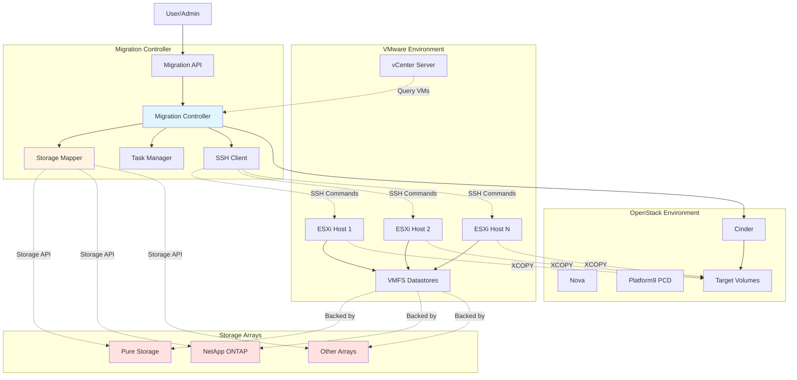
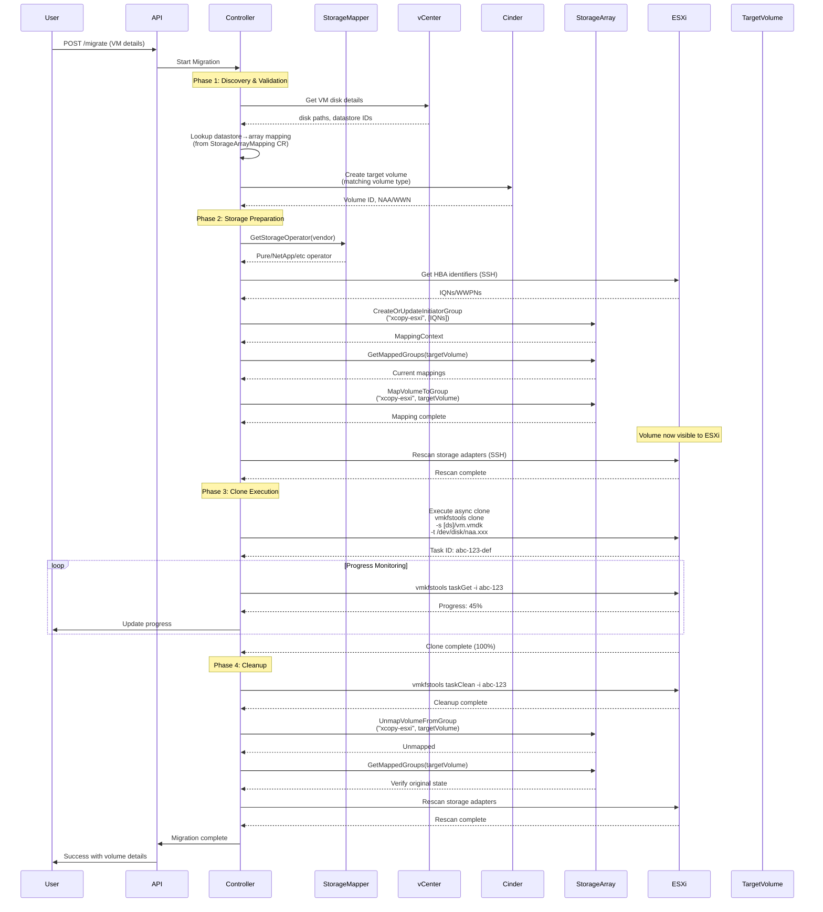
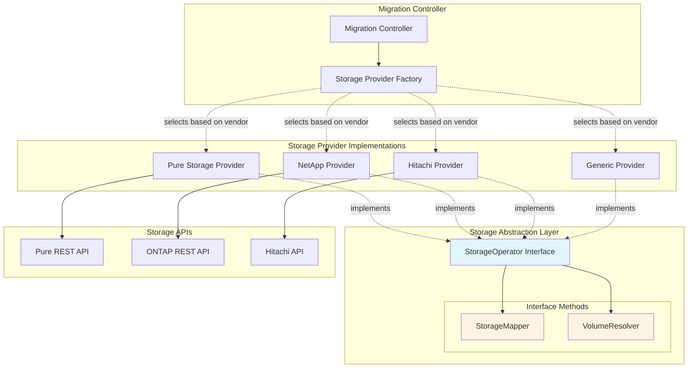
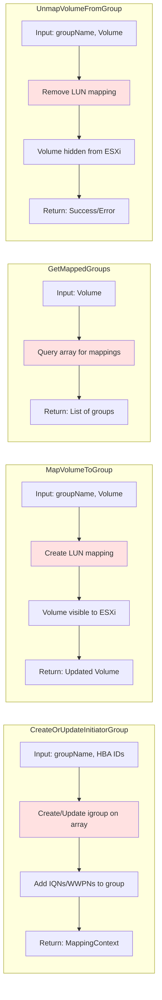
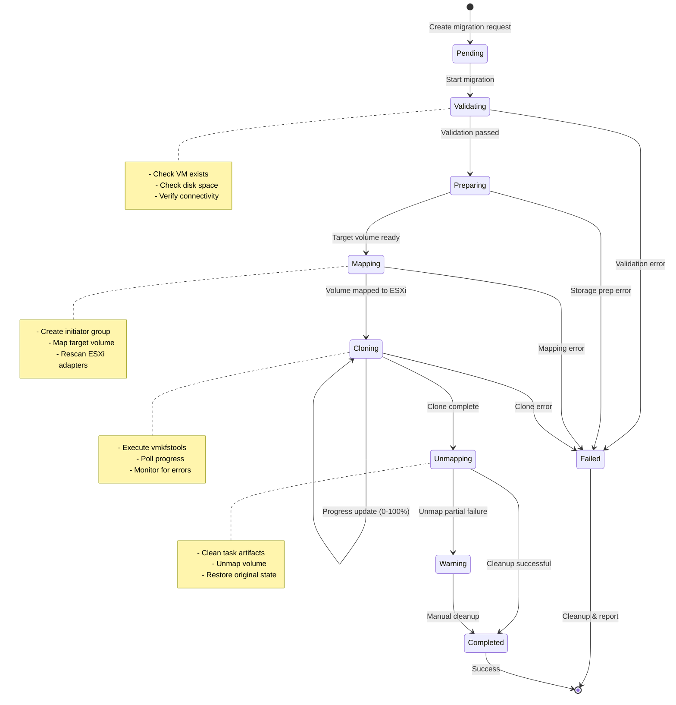
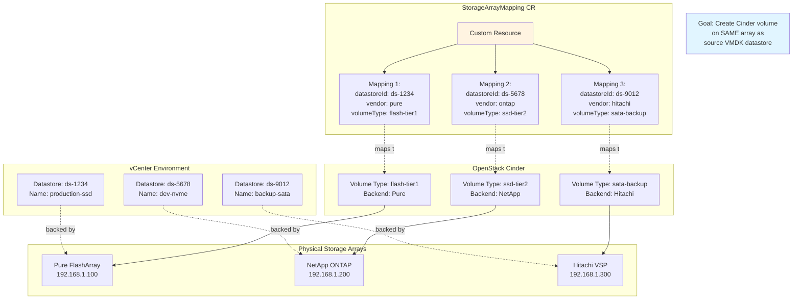
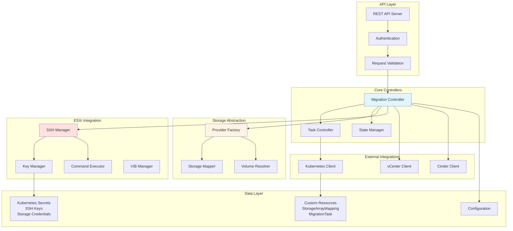
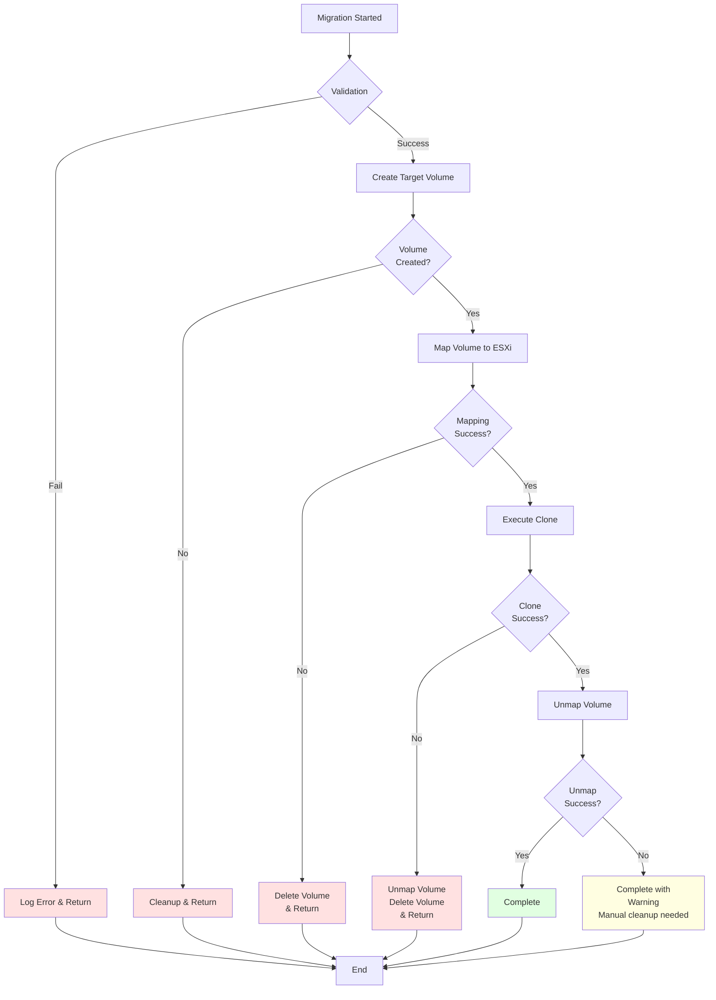

# VM Migration Architecture Diagrams

## 1. System Context Diagram



## 2. Complete Clone Operation Sequence Diagram



## 3. Storage Interface Architecture



## 4. StorageMapper Interface Methods Flow



## 5. Task State Machine



## 6. SSH vs VIB Architecture Comparison

```mermaid
graph TB
    subgraph "SSH-Based Architecture"
        SSH_Controller[Migration Controller]
        SSH_Client[SSH Client with Keys]
        SSH_Script[Python Wrapper Script<br/>on Datastore]
        SSH_Restricted[Restricted SSH Key<br/>command= limitation]
        SSH_VMK[vmkfstools Process]
        
        SSH_Controller --> SSH_Client
        SSH_Client --> SSH_Restricted
        SSH_Restricted --> SSH_Script
        SSH_Script --> SSH_VMK
    end
    
    subgraph "VIB-Based Architecture"
        VIB_Controller[Migration Controller]
        VIB_vCenter[vCenter API]
        VIB_ESXCLI[esxcli Framework]
        VIB_Plugin[Custom VIB Plugin<br/>/usr/lib/vmware/esxcli/]
        VIB_Wrapper[Wrapper Script<br/>/opt/pf9/]
        VIB_VMK[vmkfstools Process]
        
        VIB_Controller --> VIB_vCenter
        VIB_vCenter --> VIB_ESXCLI
        VIB_ESXCLI --> VIB_Plugin
        VIB_Plugin --> VIB_Wrapper
        VIB_Wrapper --> VIB_VMK
    end
    
    SSH_Pros["✓ No installation required<br/>✓ No reboot needed<br/>✓ Easy updates<br/>✓ Better for security-restricted"]
    
    VIB_Pros["✓ vCenter API access<br/>✓ Native ESXi integration<br/>✓ Persistent across reboots<br/>✓ Standard VMware method"]
    
    style SSH_Controller fill:#e1ffe1
    style VIB_Controller fill:#e1e1ff
    style SSH_Pros fill:#e1ffe1
    style VIB_Pros fill:#e1e1ff
```



## 7. Datastore to Storage Array Mapping



## 8. Component Architecture Detail



## 9. Error Recovery Flow



## 10. SSH Key Setup and Security Flow

```mermaid
sequenceDiagram
    participant Admin
    participant System
    participant K8sSecrets
    participant ESXi
    participant Datastore
    
    Note over Admin,ESXi: Option 1: System-Generated Keys
    
    Admin->>System: Deploy migration controller
    System->>System: Generate 2048-bit RSA keypair
    System->>K8sSecrets: Store private key
    System->>K8sSecrets: Store public key
    System->>Admin: Display public key
    
    Admin->>Admin: Copy public key
    Admin->>ESXi: Enable SSH service
    Admin->>Datastore: Upload secure-vmkfstools-wrapper.py
    Admin->>ESXi: Create restricted authorized_keys entry<br/>command="python /vmfs/volumes/.../wrapper.py"
    
    Note over Admin,ESXi: Option 2: User-Provided Keys
    
    Admin->>Admin: Generate own keypair<br/>ssh-keygen -t rsa -b 4096
    Admin->>K8sSecrets: Upload private key
    Admin->>K8sSecrets: Upload public key
    Admin->>ESXi: Enable SSH service
    Admin->>Datastore: Upload secure-vmkfstools-wrapper.py
    Admin->>ESXi: Create restricted authorized_keys entry
    
    Note over System,ESXi: Runtime: Command Execution
    
    System->>ESXi: SSH connect with private key
    ESXi->>ESXi: Validate key
    ESXi->>Datastore: Force execute wrapper.py
    Datastore->>Datastore: Wrapper validates command<br/>against whitelist
    Datastore->>Datastore: Sanitize parameters
    Datastore->>ESXi: Execute vmkfstools
    ESXi->>System: Return task ID
    
    style K8sSecrets fill:#ffe1e1
    style Datastore fill:#fff4e1
```

---

## Usage Notes

These diagrams cover:

1. **System Context** - Overall architecture
2. **Sequence Diagram** - Complete operation flow
3. **Storage Interface** - Abstraction layer design
4. **Interface Methods** - Detailed method flows
5. **State Machine** - Task lifecycle
6. **SSH vs VIB** - Architecture comparison
7. **Datastore Mapping** - Storage array correlation
8. **Component Detail** - Internal architecture
9. **Error Recovery** - Failure handling
10. **SSH Security** - Key setup and command restriction

You can view these in any Markdown viewer that supports Mermaid diagrams (GitHub, GitLab, VS Code with extensions, etc.)
