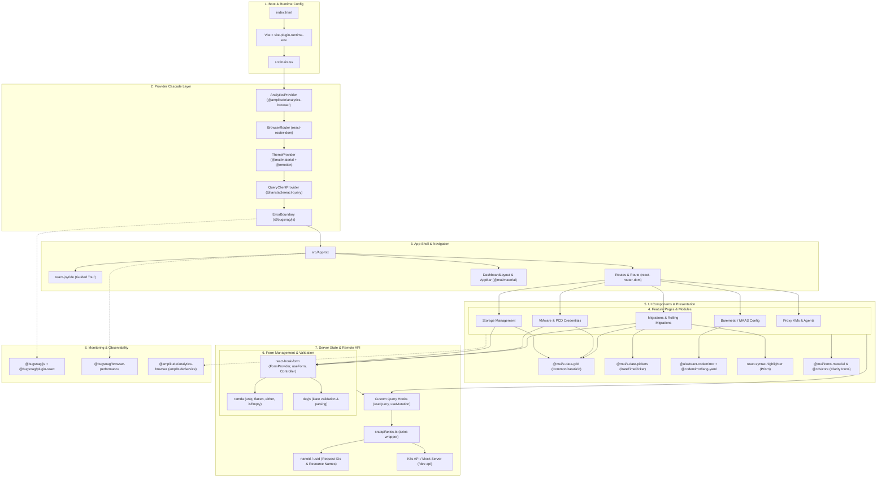
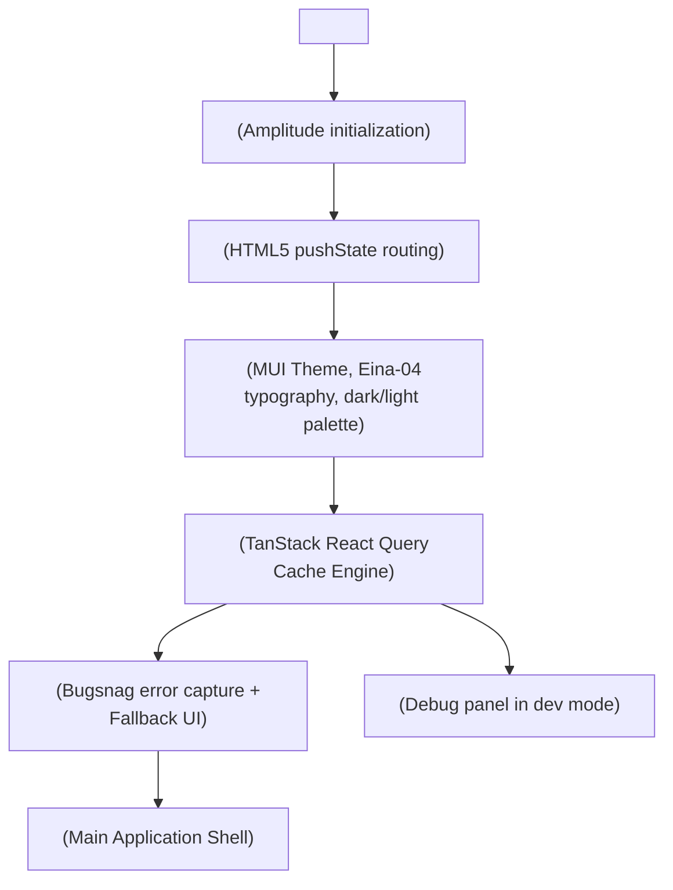
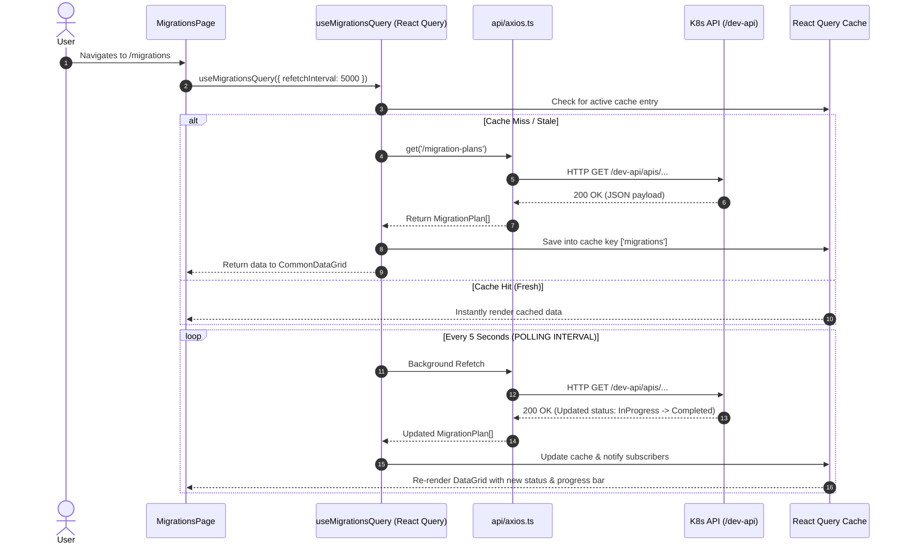
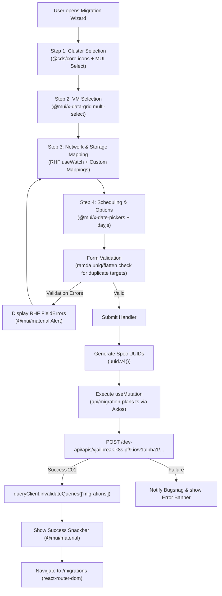
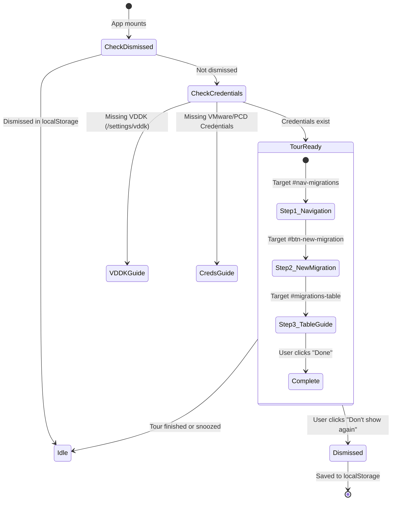

# UI Libraries Architecture & Flow Guide

This document provides a comprehensive technical breakdown of all libraries used in the `vjailbreak` UI (`ui/`), explaining how they interact, their execution lifecycle, detailed architecture flow diagrams (Mermaid), and the specific parts/APIs used across the codebase.

---

## Table of Contents

1. [High-Level Architecture & Library Flow](#1-high-level-architecture--library-flow)
2. [Application Bootstrap & Provider Hierarchy](#2-application-bootstrap--provider-hierarchy)
3. [Library Breakdown: What Parts Are Used & Where](#3-library-breakdown-what-parts-are-used--where)
   - [Core Framework & Build Tooling](#core-framework--build-tooling)
   - [Routing & Navigation](#routing--navigation)
   - [Design System, Styling & Components](#design-system-styling--components)
   - [Data Tables & Grids](#data-tables--grids)
   - [Date & Time Management](#date--time-management)
   - [Icons & Visual Indicators](#icons--visual-indicators)
   - [Server-State, Caching & Data Synchronization](#server-state-caching--data-synchronization)
   - [HTTP & Network Transport](#http--network-transport)
   - [Form Management & Validation](#form-management--validation)
   - [Code Editing & Syntax Highlighting](#code-editing--syntax-highlighting)
   - [Onboarding & Guided Tours](#onboarding--guided-tours)
   - [Telemetry, Analytics & Error Tracking](#telemetry-analytics--error-tracking)
   - [Utility & Helper Libraries](#utility--helper-libraries)
   - [Testing, QA & Storybook](#testing-qa--storybook)
4. [Lifecycle & Interaction Flow Diagrams](#4-lifecycle--interaction-flow-diagrams)
   - [Data Fetching & Polling Lifecycle](#data-fetching--polling-lifecycle)
   - [Form Submission & Validation Flow](#form-submission--validation-flow)
   - [User Onboarding & Joyride Guided Tour Flow](#user-onboarding--joyride-guided-tour-flow)
   - [Telemetry & Error Reporting Pipeline](#telemetry--error-reporting-pipeline)
5. [Summary Quick-Reference Matrix](#5-summary-quick-reference-matrix)

---

## 1. High-Level Architecture & Library Flow

The UI is built as a single-page React application powered by Vite. The following diagram illustrates how the libraries connect, from initial boot to rendering, state management, and backend communication:



---

## 2. Application Bootstrap & Provider Hierarchy

Every request and state change passes through a strictly ordered chain of React contexts defined in [`src/main.tsx`](file:///Users/archit-pf9/v-jb/vjailbreak/ui/src/main.tsx).



### Why this specific order matters:
1. **`AnalyticsProvider`** wraps outer components to track initial route visits and user sessions.
2. **`BrowserRouter`** must be outside `ThemeProvider` and `App` so router hooks (`useLocation`, `useNavigate`) can be accessed anywhere inside.
3. **`ThemeProvider`** injects the Emotion style engine and MUI design tokens so all child components can use `theme` and `styled`.
4. **`QueryClientProvider`** makes `useQuery` and `useMutation` available to the `ErrorBoundary` and the entire application.
5. **`ErrorBoundary`** catches unhandled React render errors before they crash the page, presenting a recovery UI and forwarding errors to Bugsnag.

---

## 3. Library Breakdown: What Parts Are Used & Where

### Core Framework & Build Tooling

| Library | Version | Role in Project | What Part We Use | Primary Files / Usages |
| :--- | :--- | :--- | :--- | :--- |
| **`react`** | `^18.3.1` | Core UI engine | Component model, hooks (`useState`, `useEffect`, `useMemo`, `useCallback`, `useRef`, `createContext`, `useContext`) | Throughout all `.tsx` components in `src/` |
| **`react-dom`** | `^18.3.1` | DOM renderer | `createRoot(document.getElementById('root')!)` | [`src/main.tsx`](file:///Users/archit-pf9/v-jb/vjailbreak/ui/src/main.tsx#L4) |
| **`typescript`** | `^5.5.3` | Type safety | Static type checking, interfaces for K8s Custom Resources, form schemas | `tsconfig.json`, `src/types/`, all `.ts`/`.tsx` |
| **`vite`** | `^5.4.1` | Build & dev server | Fast HMR dev server, proxy to `/dev-api`, production Rollup bundle | [`vite.config.ts`](file:///Users/archit-pf9/v-jb/vjailbreak/ui/vite.config.ts) |
| **`vite-plugin-runtime-env`** | `^0.1.1` | Env variable injection | Injects runtime env variables (like `VITE_API_HOST`, `VITE_API_TOKEN`) into the browser bundle without rebuilding | [`vite.config.ts`](file:///Users/archit-pf9/v-jb/vjailbreak/ui/vite.config.ts#L4) |

---

### Routing & Navigation

| Library | Version | Role in Project | What Part We Use | Primary Files / Usages |
| :--- | :--- | :--- | :--- | :--- |
| **`react-router-dom`** | `^6.26.2` | Client-side routing | - `BrowserRouter`<br>- `Routes`, `Route`<br>- `useLocation`, `useNavigate`<br>- `Navigate` (redirects)<br>- `useParams`, `useSearchParams` | - [`src/main.tsx`](file:///Users/archit-pf9/v-jb/vjailbreak/ui/src/main.tsx#L5)<br>- [`src/App.tsx`](file:///Users/archit-pf9/v-jb/vjailbreak/ui/src/App.tsx#L3)<br>- Feature navigation in `src/features/*/pages/` |

**Flow:**
1. `BrowserRouter` tracks browser history and URL changes.
2. In [`src/App.tsx`](file:///Users/archit-pf9/v-jb/vjailbreak/ui/src/App.tsx), `<Routes>` matches paths:
   - `/migrations` $\rightarrow$ `MigrationsPage`
   - `/cluster-conversions` $\rightarrow$ `ClusterConversionsPage`
   - `/credentials/vm` $\rightarrow$ `VmCredentialsPage`
   - `/baremetal-config` $\rightarrow$ `MaasConfigPage`
   - `/storage-management` $\rightarrow$ `StorageManagementPage`
3. Components use `useNavigate()` to transition between steps or jump directly to newly created migration details.

---

### Design System, Styling & Components

| Library | Version | Role in Project | What Part We Use | Primary Files / Usages |
| :--- | :--- | :--- | :--- | :--- |
| **`@mui/material`** | `^6.5.0` | Primary UI component library | - Layout: `Box`, `Grid`, `Stack`, `Container`, `Paper`<br>- Components: `Button`, `IconButton`, `TextField`, `Select`, `MenuItem`, `Drawer`, `Dialog`, `Modal`, `Snackbar`, `Alert`, `Tabs`, `Tab`, `Tooltip`, `Chip`, `Switch`<br>- Theming & Styling: `ThemeProvider`, `createTheme`, `styled`, `alpha`, `darken`, `lighten`, `CssBaseline` | - [`src/theme/ThemeContext.tsx`](file:///Users/archit-pf9/v-jb/vjailbreak/ui/src/theme/ThemeContext.tsx)<br>- [`src/App.tsx`](file:///Users/archit-pf9/v-jb/vjailbreak/ui/src/App.tsx)<br>- Shared forms in `src/shared/components/forms/` |
| **`@emotion/react`** | `^11.13.3` | CSS-in-JS style engine | Underlying styling engine for MUI; `jsxImportSource: "@emotion/react"` configured in Vite | [`vite.config.ts`](file:///Users/archit-pf9/v-jb/vjailbreak/ui/vite.config.ts#L14) |
| **`@emotion/styled`** | `^11.13.0` | Custom component styling | Powers `styled('div')(({ theme }) => ({ ... }))` across layouts | Used by MUI's `styled` utility in `src/App.tsx` and custom components |
| **`@fontsource/roboto`** | `^5.1.0` | Fallback typography | Roboto font weights imported for standard Material typography | [`src/theme/typography.ts`](file:///Users/archit-pf9/v-jb/vjailbreak/ui/src/theme/typography.ts) |
| **`stylis`** | `^4.4.0` | CSS prefixer & AST compiler | Used internally by Emotion for parsing, auto-prefixing, and RTL support | Internal dependency for Emotion in MUI |
| **`@popperjs/core`** | `^2.11.8` | Popover positioning engine | Powers dropdown menus, tooltips, and popovers | Internal engine for `@mui/material/Tooltip` and `Popover` |

---

### Data Tables & Grids

| Library | Version | Role in Project | What Part We Use | Primary Files / Usages |
| :--- | :--- | :--- | :--- | :--- |
| **`@mui/x-data-grid`** | `^7.17.0` | Rich data tables for all list views | - `DataGrid`<br>- `GridColDef`, `GridRowSelectionModel`, `GridRowParams`<br>- `GridToolbarContainer`, `GridToolbarQuickFilter`<br>- `GRID_CHECKBOX_SELECTION_COL_DEF` | - [`src/components/grid/CommonDataGrid.tsx`](file:///Users/archit-pf9/v-jb/vjailbreak/ui/src/components/grid/CommonDataGrid.tsx)<br>- [`src/features/migration/components/MigrationsTable.tsx`](file:///Users/archit-pf9/v-jb/vjailbreak/ui/src/features/migration/components/MigrationsTable.tsx)<br>- [`src/features/migration/steps/VmsSelectionStep.tsx`](file:///Users/archit-pf9/v-jb/vjailbreak/ui/src/features/migration/steps/VmsSelectionStep.tsx)<br>- [`src/features/credentials/components/CredentialsTable.tsx`](file:///Users/archit-pf9/v-jb/vjailbreak/ui/src/features/credentials/components/CredentialsTable.tsx) |

**Flow:**
1. Feature hooks fetch backend data (e.g. `useMigrationsQuery`).
2. Data is passed into `CommonDataGrid` (a custom wrapper over `@mui/x-data-grid`).
3. Columns are strongly typed with `GridColDef[]`.
4. Selection events feed into `GridRowSelectionModel`, enabling bulk actions (bulk edit IP, retry migrations, cancel).

---

### Date & Time Management

| Library | Version | Role in Project | What Part We Use | Primary Files / Usages |
| :--- | :--- | :--- | :--- | :--- |
| **`@mui/x-date-pickers`** | `^7.20.0` | Date & time input pickers | - `DateTimePicker`<br>- `LocalizationProvider`<br>- `AdapterDayjs` | - [`src/features/migration/steps/MigrationOptionsAlt.tsx`](file:///Users/archit-pf9/v-jb/vjailbreak/ui/src/features/migration/steps/MigrationOptionsAlt.tsx#L16)<br>- [`src/shared/components/forms/rhf/RHFDateTimeField.tsx`](file:///Users/archit-pf9/v-jb/vjailbreak/ui/src/shared/components/forms/rhf/RHFDateTimeField.tsx#L2) |
| **`dayjs`** | `^1.11.13` | Date parsing & formatting | `Dayjs` object manipulation, date comparison, adapter for MUI DatePickers | - [`src/shared/components/forms/rhf/RHFDateTimeField.tsx`](file:///Users/archit-pf9/v-jb/vjailbreak/ui/src/shared/components/forms/rhf/RHFDateTimeField.tsx#L3)<br>- [`src/features/migration/steps/MigrationOptionsAlt.tsx`](file:///Users/archit-pf9/v-jb/vjailbreak/ui/src/features/migration/steps/MigrationOptionsAlt.tsx#L18) |
| **`date-fns`** | `^4.1.0` | Date duration utilities | `intervalToDuration` for calculating node/migration runtimes and uptimes | [`src/features/agents/components/NodesTable.tsx`](file:///Users/archit-pf9/v-jb/vjailbreak/ui/src/features/agents/components/NodesTable.tsx#L19) |

---

### Icons & Visual Indicators

| Library | Version | Role in Project | What Part We Use | Primary Files / Usages |
| :--- | :--- | :--- | :--- | :--- |
| **`@mui/icons-material`** | `^6.5.0` | Standard UI icons | Dozens of icons (`CheckCircle`, `ErrorOutline`, `PlayArrow`, `Refresh`, `Delete`, `Edit`, `ExpandMore`, `Search`, etc.) | Used across virtually all layout and feature views |
| **`@cds/core`** | `^6.15.1` | VMware Clarity Design System icons | - Icon registration: `@cds/core/icon/register.js`<br>- Icons: `ClarityIcons`, `buildingIcon`, `clusterIcon`, `hostIcon`, `vmIcon`, `searchIcon` | - [`src/features/migration/steps/SourceDestinationClusterSelection.tsx`](file:///Users/archit-pf9/v-jb/vjailbreak/ui/src/features/migration/steps/SourceDestinationClusterSelection.tsx#L17)<br>- [`src/features/migration/steps/VmsSelectionStep.tsx`](file:///Users/archit-pf9/v-jb/vjailbreak/ui/src/features/migration/steps/VmsSelectionStep.tsx#L39)<br>- [`src/features/clusterConversions/components/RollingMigrationsTable.tsx`](file:///Users/archit-pf9/v-jb/vjailbreak/ui/src/features/clusterConversions/components/RollingMigrationsTable.tsx#L31) |

---

### Server-State, Caching & Data Synchronization

| Library | Version | Role in Project | What Part We Use | Primary Files / Usages |
| :--- | :--- | :--- | :--- | :--- |
| **`@tanstack/react-query`** | `^5.59.20` | Server-state management, caching, polling, mutation | - `QueryClient`, `QueryClientProvider`<br>- `useQuery`, `UseQueryOptions`, `UseQueryResult`<br>- `useMutation`<br>- `useQueryClient` (cache invalidation via `queryClient.invalidateQueries`) | - Root setup in [`src/main.tsx`](file:///Users/archit-pf9/v-jb/vjailbreak/ui/src/main.tsx#L1)<br>- Custom query hooks in [`src/hooks/api/`](file:///Users/archit-pf9/v-jb/vjailbreak/ui/src/hooks/api/)<br>- Mutations in `useSaveAsTemplate`, `useRetrySubmit`, `useDeleteMigrations` |
| **`@tanstack/react-query-devtools`** | `^5.59.20` | Development inspection | `<ReactQueryDevtools initialIsOpen={false} />` for inspecting query keys, cache status, and refetching | [`src/main.tsx`](file:///Users/archit-pf9/v-jb/vjailbreak/ui/src/main.tsx#L22) |

---

### HTTP & Network Transport

| Library | Version | Role in Project | What Part We Use | Primary Files / Usages |
| :--- | :--- | :--- | :--- | :--- |
| **`axios`** | `^1.7.7` | HTTP Client | - `axios.create({ withCredentials: true })`<br>- Request helpers: `get`, `post`, `put`, `patch`, `del`, `getBlob`<br>- Authorization header injection (`Bearer ${token}`) | [`src/api/axios.ts`](file:///Users/archit-pf9/v-jb/vjailbreak/ui/src/api/axios.ts#L1), consumed by all API files in [`src/api/`](file:///Users/archit-pf9/v-jb/vjailbreak/ui/src/api/) |

---

### Form Management & Validation

| Library | Version | Role in Project | What Part We Use | Primary Files / Usages |
| :--- | :--- | :--- | :--- | :--- |
| **`react-hook-form`** | `^7.66.1` | Performant form state management | - `useForm`, `FormProvider`, `useFormContext`<br>- `Controller`<br>- `useWatch`<br>- `useFieldArray`<br>- Types: `SubmitHandler`, `FieldErrors`, `UseFormReturn` | - Core RHF form wrappers in [`src/shared/components/forms/rhf/`](file:///Users/archit-pf9/v-jb/vjailbreak/ui/src/shared/components/forms/rhf/)<br>- Wizard forms in [`src/features/migration/pages/MigrationForm.tsx`](file:///Users/archit-pf9/v-jb/vjailbreak/ui/src/features/migration/pages/MigrationForm.tsx)<br>- Form builders in `GenericFormBuilder.tsx` |

**Flow:**
1. A wizard drawer or dialog instantiates `useForm<FormValues>()`.
2. `<FormProvider>` broadcasts the form context to nested step components.
3. Form controls wrap MUI inputs with RHF `<Controller>` (e.g. `RHFTextField`, `RHFSelect`, `RHFDateTimeField`).
4. Values are synchronized across steps using `useWatch` and custom hooks (`useFormSync`, `useRollingFormSync`).
5. On submission, validated data is dispatched to React Query mutations (`useMigrationFormSubmit`).

---

### Code Editing & Syntax Highlighting

| Library | Version | Role in Project | What Part We Use | Primary Files / Usages |
| :--- | :--- | :--- | :--- | :--- |
| **`@uiw/react-codemirror`** | `^4.23.10` | Embedded interactive code editor | `<CodeMirror />` editor component for editing YAML configuration files in Baremetal / MAAS settings | [`src/features/baremetalConfig/components/BMConfigForm.tsx`](file:///Users/archit-pf9/v-jb/vjailbreak/ui/src/features/baremetalConfig/components/BMConfigForm.tsx#L18) |
| **`@codemirror/lang-yaml`** | `^6.1.2` | YAML syntax extension | `yaml()` language extension for syntax highlighting and linting inside CodeMirror | [`src/features/baremetalConfig/components/BMConfigForm.tsx`](file:///Users/archit-pf9/v-jb/vjailbreak/ui/src/features/baremetalConfig/components/BMConfigForm.tsx#L20) |
| **`react-syntax-highlighter`** | `^15.6.1` | Read-only syntax highlighting | `SyntaxHighlighter` (Prism ESM version) with `oneLight` theme for displaying formatted config files in detail modals | [`src/features/migration/components/MaasConfigDetailDialog.tsx`](file:///Users/archit-pf9/v-jb/vjailbreak/ui/src/features/migration/components/MaasConfigDetailDialog.tsx#L11) |

---

### Onboarding & Guided Tours

| Library | Version | Role in Project | What Part We Use | Primary Files / Usages |
| :--- | :--- | :--- | :--- | :--- |
| **`react-joyride`** | `^2.9.3` | Interactive guided walkthrough | - `<Joyride />` component<br>- `JoyrideStep`<br>- `CallBackProps`<br>- Controls beacon steps, tooltips, target element highlighting, and dismiss/snooze | Controlled from [`src/App.tsx`](file:///Users/archit-pf9/v-jb/vjailbreak/ui/src/App.tsx#L4), guiding users through VDDK upload, VMware credentials, and creating their first migration |

---

### Telemetry, Analytics & Error Tracking

| Library | Version | Role in Project | What Part We Use | Primary Files / Usages |
| :--- | :--- | :--- | :--- | :--- |
| **`@amplitude/analytics-browser`** | `^2.5.0` | Product analytics & event tracking | - `amplitude.init`<br>- `amplitude.track`<br>- `amplitude.setUserId` | Wrapped by [`src/services/amplitudeService.ts`](file:///Users/archit-pf9/v-jb/vjailbreak/ui/src/services/amplitudeService.ts) and initialized in `AnalyticsProvider` |
| **`@bugsnag/js`** | `^8.4.0` | Crash reporting & unhandled error tracking | `Bugsnag.start`, `Bugsnag.notify`, `Client` | Wrapped by [`src/services/errorReporting.ts`](file:///Users/archit-pf9/v-jb/vjailbreak/ui/src/services/errorReporting.ts) & [`src/hooks/useAnalytics.ts`](file:///Users/archit-pf9/v-jb/vjailbreak/ui/src/hooks/useAnalytics.ts) |
| **`@bugsnag/plugin-react`** | `^8.4.0` | React-specific error integration | `BugsnagPluginReact` for automatic error boundary instrumentation | [`src/hooks/useAnalytics.ts`](file:///Users/archit-pf9/v-jb/vjailbreak/ui/src/hooks/useAnalytics.ts#L3) |
| **`@bugsnag/browser-performance`** | `^2.14.0` | Real user monitoring (RUM) & load performance | `BugsnagPerformance.start` for measuring page loads, spans, and network latency | [`src/hooks/useAnalytics.ts`](file:///Users/archit-pf9/v-jb/vjailbreak/ui/src/hooks/useAnalytics.ts#L4) |

---

### Utility & Helper Libraries

| Library | Version | Role in Project | What Part We Use | Primary Files / Usages |
| :--- | :--- | :--- | :--- | :--- |
| **`ramda`** | `^0.30.1` | Functional utilities | - `either`, `isEmpty`, `isNil` (predicate functions)<br>- `uniq`, `flatten` (array deduplication) | - [`src/utils.ts`](file:///Users/archit-pf9/v-jb/vjailbreak/ui/src/utils.ts#L1)<br>- [`src/features/migration/hooks/useFormValidation.ts`](file:///Users/archit-pf9/v-jb/vjailbreak/ui/src/features/migration/hooks/useFormValidation.ts#L2) |
| **`uuid`** | `^10.0.0` | RFC4122 UUID generation | `v4 as uuidv4` for unique resource names, migration plan IDs, and mapping keys | In helper builders: `api/migration-plans/helpers.ts`, `api/vmware-creds/helpers.ts`, `api/network-mapping/helpers.ts` |
| **`nanoid`** | `^5.0.9` | URL-safe compact ID generator | `customAlphabet('abcdefghijklmnopqrstuvwxyz0123456789', 6)` for generating Kubernetes-compatible node agent names | [`src/api/nodes/nodeMappings.ts`](file:///Users/archit-pf9/v-jb/vjailbreak/ui/src/api/nodes/nodeMappings.ts#L7) |

---

### Testing, QA & Storybook

| Tool | Version | Role | Configuration / Files |
| :--- | :--- | :--- | :--- |
| **`vitest`** | `^4.1.9` | Unit & integration test runner | [`vitest.config.ts`](file:///Users/archit-pf9/v-jb/vjailbreak/ui/vitest.config.ts), runs `src/**/*.test.{ts,tsx}` |
| **`@testing-library/react`** | `^16.3.2` | Component test rendering & assertions | `render`, `screen`, `waitFor` in component tests |
| **`@testing-library/jest-dom`** | `^6.9.1` | Custom DOM matchers | `expect(...).toBeInTheDocument()`, `toHaveValue()` |
| **`@testing-library/user-event`** | `^14.6.1` | Realistic browser event simulations | `userEvent.click()`, `userEvent.type()` |
| **`@playwright/test`** | `^1.60.0` | End-to-end migration tests against live/mock clusters | [`playwright.config.ts`](file:///Users/archit-pf9/v-jb/vjailbreak/ui/playwright.config.ts), tests in `e2e/migration/` |
| **`storybook`** | `8.6.14` | Isolated UI component development | [`.storybook/`](file:///Users/archit-pf9/v-jb/vjailbreak/ui/.storybook/), `src/**/*.stories.tsx` |

---

## 4. Lifecycle & Interaction Flow Diagrams

### Data Fetching & Polling Lifecycle

The migration system continuously updates VM statuses, VDDK progress, and agent heartbeats via React Query polling intervals:



---

### Form Submission & Validation Flow

Creation of a new migration plan using React Hook Form, Dayjs, Ramda, and React Query:



---

### User Onboarding & Joyride Guided Tour Flow

`react-joyride` orchestrates the initial first-run onboarding sequence:



---

### Telemetry & Error Reporting Pipeline

How crashes and user actions are captured across Bugsnag and Amplitude:

```mermaid
flowchart LR
    subgraph UIEvent["UI Activity"]
        Action["User Clicks Action"]
        Crash["Render Crash / JS Error"]
    end

    subgraph Tracking["Tracking Services"]
        AmpService["src/services/amplitudeService.ts"]
        BugsnagService["src/services/errorReporting.ts"]
        PerfService["@bugsnag/browser-performance"]
    end

    subgraph Providers["Destinations"]
        AmpCloud["Amplitude Analytics Dashboard"]
        BugsnagCloud["Bugsnag Error Monitoring"]
    end

    Action --> AmpService
    AmpService -->|track(event, properties)| AmpCloud

    Crash -->|<ErrorBoundary> catches| BugsnagService
    BugsnagService -->|notify(error, metadata)| BugsnagCloud

    UIEvent -.->|Page load & XHR metrics| PerfService
    PerfService --> BugsnagCloud
```

---

## 5. Summary Quick-Reference Matrix

| Category | Library | Primary Exports / APIs Used in Project | Key Repository Location |
| :--- | :--- | :--- | :--- |
| **Framework** | `react` | `useState`, `useEffect`, `useMemo`, `useCallback`, `useRef`, `useContext`, `createContext` | All `.tsx` files in `src/` |
| **Framework** | `react-dom` | `createRoot` | [`src/main.tsx`](file:///Users/archit-pf9/v-jb/vjailbreak/ui/src/main.tsx) |
| **Build** | `vite` | `defineConfig`, `loadEnv`, dev server proxy | [`vite.config.ts`](file:///Users/archit-pf9/v-jb/vjailbreak/ui/vite.config.ts) |
| **Routing** | `react-router-dom` | `BrowserRouter`, `Routes`, `Route`, `useLocation`, `useNavigate`, `Navigate` | [`src/App.tsx`](file:///Users/archit-pf9/v-jb/vjailbreak/ui/src/App.tsx), [`src/main.tsx`](file:///Users/archit-pf9/v-jb/vjailbreak/ui/src/main.tsx) |
| **UI Components** | `@mui/material` | `Button`, `Dialog`, `Drawer`, `Snackbar`, `Alert`, `Box`, `Grid`, `Typography`, `ThemeProvider` | [`src/theme/ThemeContext.tsx`](file:///Users/archit-pf9/v-jb/vjailbreak/ui/src/theme/ThemeContext.tsx), `src/components/` |
| **Styling** | `@emotion/react` / `@emotion/styled` | `styled`, JSX emotion pragma | [`src/App.tsx`](file:///Users/archit-pf9/v-jb/vjailbreak/ui/src/App.tsx), [`vite.config.ts`](file:///Users/archit-pf9/v-jb/vjailbreak/ui/vite.config.ts) |
| **Tables** | `@mui/x-data-grid` | `DataGrid`, `GridColDef`, `GridRowSelectionModel`, `GridToolbarQuickFilter` | [`src/components/grid/CommonDataGrid.tsx`](file:///Users/archit-pf9/v-jb/vjailbreak/ui/src/components/grid/CommonDataGrid.tsx) |
| **Dates** | `@mui/x-date-pickers` + `dayjs` | `DateTimePicker`, `LocalizationProvider`, `AdapterDayjs` | [`src/shared/components/forms/rhf/RHFDateTimeField.tsx`](file:///Users/archit-pf9/v-jb/vjailbreak/ui/src/shared/components/forms/rhf/RHFDateTimeField.tsx) |
| **Dates** | `date-fns` | `intervalToDuration` | [`src/features/agents/components/NodesTable.tsx`](file:///Users/archit-pf9/v-jb/vjailbreak/ui/src/features/agents/components/NodesTable.tsx) |
| **Icons** | `@mui/icons-material` | Material design icons (`CheckCircle`, `ErrorOutline`, `Refresh`, etc.) | Layouts & buttons across `src/` |
| **Icons** | `@cds/core` | `ClarityIcons`, `buildingIcon`, `clusterIcon`, `hostIcon`, `vmIcon` | Cluster & VM selection steps |
| **Server State** | `@tanstack/react-query` | `QueryClient`, `QueryClientProvider`, `useQuery`, `useMutation`, `useQueryClient` | [`src/hooks/api/`](file:///Users/archit-pf9/v-jb/vjailbreak/ui/src/hooks/api/) |
| **Network** | `axios` | `axios.create`, `get`, `post`, `put`, `patch`, `delete` | [`src/api/axios.ts`](file:///Users/archit-pf9/v-jb/vjailbreak/ui/src/api/axios.ts) |
| **Forms** | `react-hook-form` | `useForm`, `FormProvider`, `useFormContext`, `Controller`, `useWatch` | [`src/shared/components/forms/rhf/`](file:///Users/archit-pf9/v-jb/vjailbreak/ui/src/shared/components/forms/rhf/) |
| **Code Editor** | `@uiw/react-codemirror` | `CodeMirror`, `yaml()` | [`src/features/baremetalConfig/components/BMConfigForm.tsx`](file:///Users/archit-pf9/v-jb/vjailbreak/ui/src/features/baremetalConfig/components/BMConfigForm.tsx) |
| **Syntax Highlighting** | `react-syntax-highlighter` | `SyntaxHighlighter`, `oneLight` theme | [`src/features/migration/components/MaasConfigDetailDialog.tsx`](file:///Users/archit-pf9/v-jb/vjailbreak/ui/src/features/migration/components/MaasConfigDetailDialog.tsx) |
| **Onboarding** | `react-joyride` | `<Joyride />`, `JoyrideStep`, `CallBackProps` | [`src/App.tsx`](file:///Users/archit-pf9/v-jb/vjailbreak/ui/src/App.tsx) |
| **Telemetry** | `@amplitude/analytics-browser` | `init`, `track`, `setUserId` | [`src/services/amplitudeService.ts`](file:///Users/archit-pf9/v-jb/vjailbreak/ui/src/services/amplitudeService.ts) |
| **Crash Reporting** | `@bugsnag/js` | `Bugsnag.start`, `Bugsnag.notify` | [`src/services/errorReporting.ts`](file:///Users/archit-pf9/v-jb/vjailbreak/ui/src/services/errorReporting.ts) |
| **Performance** | `@bugsnag/browser-performance` | `BugsnagPerformance.start` | [`src/hooks/useAnalytics.ts`](file:///Users/archit-pf9/v-jb/vjailbreak/ui/src/hooks/useAnalytics.ts) |
| **Functional Utils** | `ramda` | `either`, `isEmpty`, `isNil`, `uniq`, `flatten` | [`src/utils.ts`](file:///Users/archit-pf9/v-jb/vjailbreak/ui/src/utils.ts), form validation hooks |
| **ID Generation** | `uuid` | `v4 as uuidv4` | API resource creation helpers |
| **ID Generation** | `nanoid` | `customAlphabet` | [`src/api/nodes/nodeMappings.ts`](file:///Users/archit-pf9/v-jb/vjailbreak/ui/src/api/nodes/nodeMappings.ts) |
